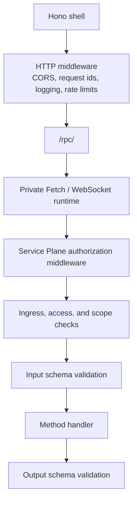
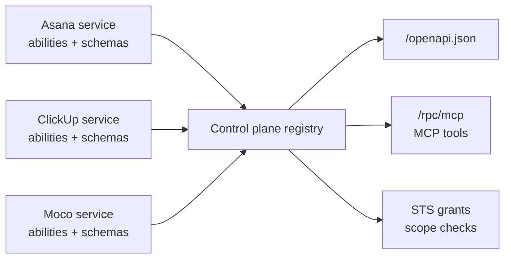

# Architecture

Goal: understand what Service Plane owns, what stays replaceable, and which layer owns auth and validation.

The smallest useful setup has three pieces:

- A service defines abilities.
- A control plane issues short-lived tokens and aggregates discovery metadata.
- A caller invokes a typed ability client through the control plane.

## Why Service Plane Exists

Normal service APIs often split into REST routes, internal RPC, OpenAPI files, custom auth checks, and separate tool metadata. Service Plane keeps those concerns tied to one source of truth: the ability.

An ability is a schema-backed RPC surface owned by a service. Each method declares:

- one input schema
- one output schema
- required scopes
- optional REST metadata
- optional MCP metadata

The schemas power runtime validation, service discovery, OpenAPI generation, and MCP tool metadata.

Schemas are [Standard Schema](https://standardschema.dev) values, so the validation library is the service author's choice rather than this package's. The package depends on the two contracts, not on a vendor: `~standard.validate()` for runtime validation and [`~standard.jsonSchema`](https://standardschema.dev/json-schema) for the projections. Two services in the same plane can use different libraries and still produce a discovery document in the same JSON Schema dialect.

## Request Flow

```mermaid
sequenceDiagram
  participant Caller as Caller
  participant Plane as Control Plane
  participant Service as Service
  participant Handler as Ability Handler

  Caller->>Plane: getTask(input)<br/>authenticated application request
  Plane->>Plane: Discover ability and check grants
  Plane->>Plane: Mint short-lived brokered token
  Plane->>Service: Service Plane RPC<br/>native binding or Fetch/WebSocket
  Service->>Service: Verify issuer, audience, expiry, signature
  Service->>Service: Check ingress, access, and method scopes
  Service->>Service: Validate input
  Service->>Handler: method(validInput)
  Handler-->>Service: result
  Service->>Service: Validate output
  Service-->>Plane: typed result or stream
  Plane-->>Caller: typed result or stream
```

## Public Contract And Private RPC Engine

Service authors define methods with `createAbilityBuilder()`. Those definitions contain schemas,
metadata, policy, and the handler, but no type from the installed RPC engine. Clients are derived as
`AbilityClient<TAbility>` and failures arrive as `ServicePlaneClientError`.

The current private engine compiles those definitions to oRPC for Fetch and WebSocket execution.
That choice is deliberately not a compatibility surface: Service Plane does not export oRPC
procedures, routers, plugins, client types, or errors. A later engine migration may change private
wire details while keeping the method builder, client shape, Hono shell, and security model stable.

Service Plane adds the distributed-service model around that method:

Authorization middleware is installed before a method's input schema, so an unauthenticated call
is refused before malformed input is parsed or a handler runs. Hono middleware still sees the outer
HTTP request, but it is not the authority for method scopes.

Production services should enable service-plane ingress protection so only brokered traffic reaches ability handlers. In that mode, `/rpc/<abilityId>` rejects valid but non-brokered capability tokens before input validation or handler creation. The broker mints a signed broker claim with the same capability issuer and JWKS trust chain the service already uses.

An `access: 'service'` ability is refused at the same point, and for the same reason: the caller's access class is a signed claim only the control plane can mint, so the service can decide from its own definition rather than from the catalog the plane discovered. Every authorization input a service acts on — scopes, ingress, access — is read from what the service currently declares, which is what keeps a plane's cached catalog unable to loosen anything.

Streaming methods return validated async iterators. The private runtime carries them over Fetch streaming or
WebSocket; a Cloudflare service-binding client uses native RPC for unary calls and automatically
falls back to that binding's `fetch` method for streams. The broker proxies the async iterator, and
MCP tools backed by streaming methods answer over SSE. See [Streaming](streaming.md).

## Why The Engine Is Internal

The important developer benefit is locality without framework lock-in. The method-first API has one
definition and returns a synchronous, lazy client:

- `createAbilityBuilder()` owns schemas, scopes, projections, timeouts, and the handler.
- `createBrokeredAbilityClient()` is fully typed from that definition and does not expose token or
  service-discovery mechanics to the application developer.
- `context.env`, `context.request`, `context.identity`, `context.signal`, and
  `context.remainingTimeoutMs()` are available in the method. `context.context` remains an
  advanced Hono escape hatch.
- Batch and compression use small Service Plane-owned options. Hibernation is selected by
  `ability.hibernationStream()` and installed automatically. WebSocket reconnect is configured on
  the Service Plane transport. TanStack Query consumes the client like any promise-returning API.

This keeps a framework update or replacement out of application source. It also creates deliberate
limits:

- Engine-specific middleware, plugins, error classes, and ecosystem adapters are not exposed. A
  feature intended for consumers must first become a Service Plane feature with stable semantics.
- There is intentionally no general multi-engine adapter registry. Service Plane has one internal
  compiler, which avoids forcing every engine's lowest common denominator into the public API.
- The current engine and wire protocol remain TypeScript-first, not a language-neutral IDL such as
  Protocol Buffers. A non-TypeScript consumer should use the generated OpenAPI or MCP surface.
- Ability clients share TypeScript types, so contract packages must be versioned deliberately.
  Runtime discovery still prevents a stale control plane from authorizing a capability the deployed
  service no longer declares, but compile-time types cannot detect every rolling-deploy mismatch.
- The internal oRPC 2.0 beta packages are pinned to one exact version and covered by compatibility
  tests. Consumers neither install matching adapters nor import them directly.
- WebSockets introduce connection ownership and reconnect behavior. Fetch remains the default for
  ordinary calls.
- Hibernation is not automatic. A Durable Object must accept the socket with the platform's
  Hibernation API and forward `webSocketMessage` and `webSocketClose` to `ServicePlaneService`.
  Hibernation is also endpoint-local: the generic central broker proxies live streams but cannot
  transfer a private service's hibernation subscription onto its public socket. A central-only
  deployment needs an application-owned Durable Object handoff for that case; Service Plane does
  not currently provide one.

The security model never belongs to the private engine. Service Plane owns issuer, audience, expiry,
JWKS rotation, delegation, ingress, access, method scopes, and proof-of-possession. Authentication
and authorization therefore survive an engine change unchanged.

## Why Hono Remains

Hono is still useful at the edge of both planes: middleware, request ids, logging, discovery,
STS/JWKS, MCP, OpenAPI, and runtime-specific WebSocket upgrades are HTTP concerns. Replacing that
shell with an internal router would remove useful composition without simplifying method code.

The split is therefore deliberate: `fetch` stays the universal runtime interface, Hono owns HTTP
composition, the private RPC runtime owns method execution and serialization, and Cloudflare native
RPC bypasses HTTP only for the unary service-to-service hop. A future Fetch-native shell can be
additive because ability methods do not depend on Hono for their normal runtime data.

## Observability

One request id follows a call across the whole plane. The control plane assigns or adopts `X-Request-Id` on every inbound request, and its broker and MCP surfaces forward that id on every outbound service call (header for HTTP transports, `request_id` query parameter for WebSocket upgrades, `requestId` field for native bindings). The service shell adopts the propagated id into its Hono `requestId` variable, echoes it on responses, and includes it in its log events, so plane and service logs correlate without extra plumbing.

Both shells emit typed, token-safe JSON log events (requests, broker connects, MCP tool calls, caller-auth rejections) to the console by default. The package never owns the application logger: every surface accepts a `log` callback that forwards events to whatever logger the app uses, and events are also exposed on the Hono context for app middleware. See the logging section in [the reference](reference.md).

## Horizontal Scaling

A control plane is designed to run as several independent replicas behind a load balancer — an
autoscaled Cloudflare deployment, or a set of on-premises instances. Replicas share **configuration
only**: the signing keys, the issuer, the service list, and the grants. They share no runtime state.

What that buys, and what it costs:

- **Any replica can verify any replica's tokens.** JWKS is derived from `signingKeys` alone, so two
  replicas on the same configuration publish byte-identical documents. A token issued by one replica
  verifies against JWKS served by another.
- **Authorization is identical on every replica.** Grants and scope checks come from configuration,
  not from a local cache. A replica holding a stale registry or OpenAPI snapshot cannot authorize
  anything the fleet would refuse — projections are descriptive, and the service remains the only
  authority on what it currently exposes.
- **Replicas may disagree about the active signing key.** That is the normal state during a rolling
  key rotation and needs no coordination, because both configurations publish both keys. See
  [Rotate The Signing Key](auth.md#rotate-the-signing-key).
- **Replay protection needs no shared store.** What bounds a replayed token request is per-request
  signing plus a short timestamp window, and both are stateless — so there is deliberately nothing
  for replicas to agree on. JWK callers narrow it further: issuance sender-constrains their token to
  the key that authenticated, so the bytes alone are not enough to use it. HMAC callers get an
  ordinary bearer token, and their residual risk is the duplicate-token window described in
  [Replay Protection](auth.md#replay-protection).
- **WebSocket connections are bound to the replica that serves them.** Fetch calls carry no
  cross-request state, which is what makes the fleet safe to load-balance. A long-lived WebSocket, by contrast,
  lives on one replica: if that replica goes away the session fails and the caller must reconnect.
  There is no session failover, and none is planned — reconnect logic belongs to the caller.

Misconfiguration is refused rather than absorbed silently. A replica with a divergent issuer produces
tokens every service rejects, and a replica signing with a key the fleet does not publish is refused
with `Unknown Service-Plane capability key id`.

That last guarantee is real only for services whose JWKS is stale relative to the divergent replica —
a cached snapshot, or a refresh the balancer happened to route elsewhere. A divergent replica serves
JWKS through the same balancer as its peers, so a service that refreshes *from it* learns its key and
accepts its tokens. Key material is fleet-wide configuration, and nothing in the plane detects that
one replica is holding a different set; keep the key list identical across replicas outside the
deliberate overlap of a rotation.

## Discovery And Projections

Services publish metadata at `/.well-known/service-plane/service.json`. The control plane fetches that metadata, validates grants, and builds projections.

Only `exposure: 'published'` methods with REST metadata enter OpenAPI. Only published methods with MCP metadata enter MCP. Private abilities remain available for broker routing and grant validation, but they are not user-facing projections.

## Core Terms

- Ability: schema-backed API surface owned by a service.
- Method: one callable operation on an ability.
- Handler: function attached directly to a Service Plane method.
- Context: runtime access such as Hono context, env, bindings, and execution context.
- Identity: verified Service Plane caller and scope claims, plus the delegated principal subject on plane-brokered calls.
- Subject: the plane principal (with optional org and principal kind) a delegated call is made on behalf of. The `sub` principal
  and `act.sub` acting-service relationship follows RFC 8693 actor semantics; `spo` is a
  Service Plane-specific organization claim and `spk` carries the optional principal kind.
- Access: whether an ability is plane-callable or restricted to service callers.
- Private: ability excluded from OpenAPI and MCP.
- Published: ability eligible for OpenAPI, MCP, or user-facing transports.

Next: [create a service](service-creation.md), [create a control plane](plane-creation.md), and [choosing a transport](transports.md).
