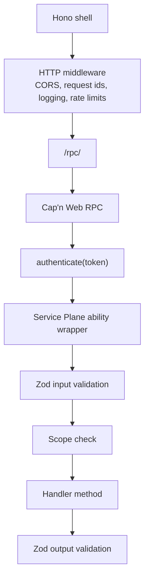
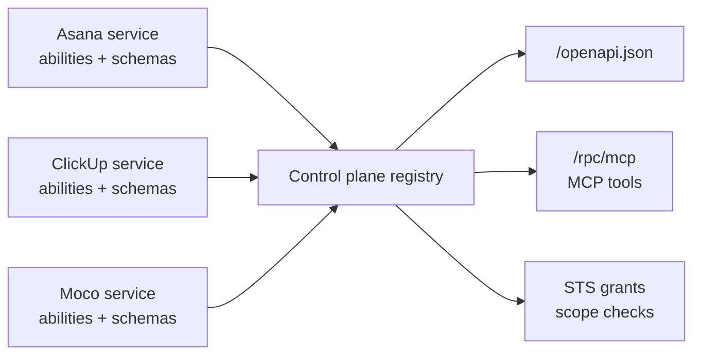

# Architecture

Goal: understand what Service Plane adds, where Cap'n Web fits, and which layer owns auth and validation.

The smallest useful setup has three pieces:

- A service defines abilities.
- A control plane issues short-lived tokens and aggregates discovery metadata.
- A caller opens an ability session and invokes methods.

## Why Service Plane Exists

Normal service APIs often split into REST routes, internal RPC, OpenAPI files, custom auth checks, and separate tool metadata. Service Plane keeps those concerns tied to one source of truth: the ability.

An ability is a schema-backed RPC surface owned by a service. Each method declares:

- one Zod input schema
- one Zod output schema
- required scopes
- optional REST metadata
- optional MCP metadata

The schemas power runtime validation, service discovery, OpenAPI generation, and MCP tool metadata.

## Request Flow

```mermaid
sequenceDiagram
  participant Caller as Caller
  participant Plane as Control Plane
  participant Service as Service
  participant Handler as Ability Handler

  Caller->>Plane: Request token<br/>caller, service, scopes
  Plane->>Plane: Check grants
  Plane-->>Caller: Short-lived ServicePlane token
  Caller->>Service: Open /rpc/asana.tasks
  Caller->>Service: authenticate(token)
  Service->>Service: Verify issuer, audience, expiry, signature
  Service-->>Caller: Validating ability RPC object
  Caller->>Service: createTask(input)
  Service->>Service: Validate input and scopes
  Service->>Handler: createTask(validInput)
  Handler-->>Service: output
  Service->>Service: Validate output
  Service-->>Caller: result
```

## What Cap'n Web Does

Cap'n Web is the RPC engine. It lets callers invoke methods on remote objects through HTTP-batch, WebSocket, or Cloudflare RPC-style bindings.

Service Plane uses Cap'n Web for the method call transport, then adds the service model around it:

Hono middleware sees the HTTP or WebSocket request. Cap'n Web sees the logical method call. That is why method auth and validation live in the Service Plane RPC wrapper, not in Hono middleware.

Production services should enable service-plane ingress protection so only brokered traffic reaches ability handlers. In that mode, `/rpc/<abilityId>` rejects valid but non-brokered capability tokens before input validation or handler creation. The broker mints a signed broker claim with the same capability issuer and JWKS trust chain the service already uses.

Methods that return many results over time (`stream: true`) use Cap'n Web's native stream support: the validating wrapper returns a `ReadableStream` of per-item-validated results with built-in flow control. Streams ride the ongoing RPC session, so they work over WebSocket, native Workers RPC bindings, and custom bidirectional transports — but not over the one-round-trip HTTP-batch transport, where streaming calls fail with a clear 405. The broker proxies these streams transparently, and MCP tools backed by streaming methods answer over SSE. The security model is unchanged — only the return shape differs. See [Streaming](streaming.md).

## Observability

One request id follows a call across the whole plane. The control plane assigns or adopts `X-Request-Id` on every inbound request, and its broker and MCP surfaces forward that id on every outbound service call (header for HTTP transports, `request_id` query parameter for WebSocket upgrades, `requestId` field for native bindings). The service shell adopts the propagated id into its Hono `requestId` variable, echoes it on responses, and includes it in its log events, so plane and service logs correlate without extra plumbing.

Both shells emit typed, token-safe JSON log events (requests, broker connects, MCP tool calls, caller-auth rejections) to the console by default. The package never owns the application logger: every surface accepts a `log` callback that forwards events to whatever logger the app uses, and events are also exposed on the Hono context for app middleware. See the logging section in [the reference](reference.md).

## Discovery And Projections

Services publish metadata at `/.well-known/service-plane/service.json`. The control plane fetches that metadata, validates grants, and builds projections.

Only `exposure: 'published'` methods with REST metadata enter OpenAPI. Only published methods with MCP metadata enter MCP. Private abilities remain available for broker routing and grant validation, but they are not user-facing projections.

## Core Terms

- Ability: schema-backed API surface owned by a service.
- Method: one callable operation on an ability.
- Handler: implementation object returned by the ability factory.
- Context: runtime access such as Hono context, env, bindings, and execution context.
- Identity: verified Service Plane caller and scope claims, plus the delegated end-user subject on user-brokered calls.
- Subject: the end user (and optional org) a delegated call is made on behalf of. The `sub` user
  and `act.sub` acting-service relationship follows RFC 8693 actor semantics; `spo` is a
  Service Plane-specific organization claim.
- Access: whether an ability is plane-callable or restricted to service callers.
- Private: ability excluded from OpenAPI and MCP.
- Published: ability eligible for OpenAPI, MCP, or user-facing transports.

Next: [create a service](service-creation.md), [create a control plane](plane-creation.md), and [choosing a transport](transports.md).
