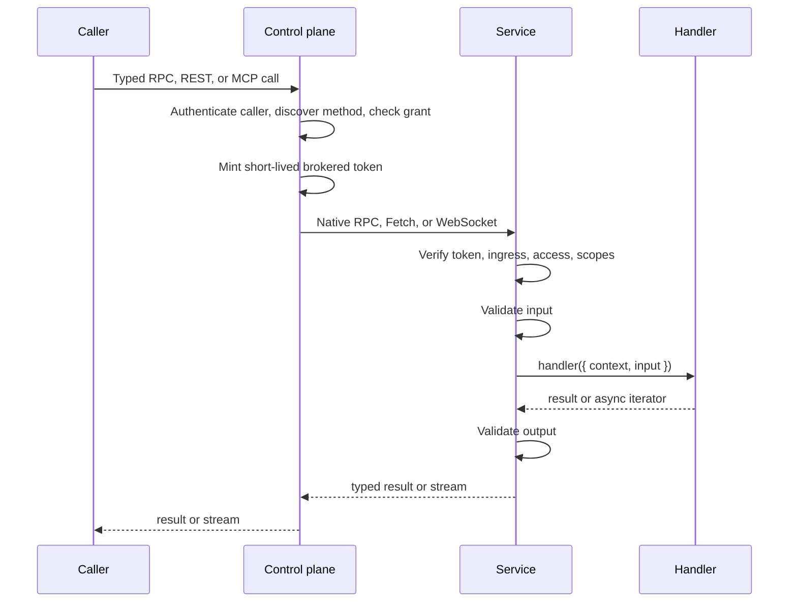

# Architecture

This page explains the boundaries of Service Plane and why they exist.

## The Model

An **ability** is a service-owned API contract. Each method has input and output schemas, required
scopes, and optional REST or MCP metadata. One definition drives:

- runtime input and output validation;
- a typed TypeScript client;
- service discovery;
- REST and OpenAPI projections; and
- MCP tools, resources, and prompts.

Schemas implement Standard Schema plus Standard JSON Schema. Services may use different validation
libraries without changing the plane.

Three roles stay deliberately separate:

| Role | Owns |
| --- | --- |
| Service | Ability contracts and handlers; token, ingress, access, scope, and schema enforcement |
| Control plane | Service discovery, grants, token issuance, routing, REST/OpenAPI, and MCP |
| Caller | Authentication to the plane, method input, and per-call metadata |

## Call Flow



The service remains the final authority. A stale discovery cache can delay a new capability, but it
cannot make a removed scope or tightened access rule valid: the deployed service checks its own
definition again before validation or handler creation.

## Contracts And Implementations

Keep browser-safe contracts separate from service-only code:

```ts
const contract = defineAbility({
  id: 'tasks',
  scopes: ['tasks.read'],
  methods: {
    get: ability.method({ input: GetTask, output: Task, scopes: ['tasks.read'] }),
  },
});

const implementation = implementAbility(contract, {
  get: ({ context, input }) => context.env.TASKS.get(input.id),
});
```

Clients import `contract`; `ServicePlaneService` receives `implementation`. The handler is stored
outside the portable contract, so a client bundle does not pull in service bindings or secrets.
For a local-only ability, an inline `handler` in `ability.method({ ... })` is the shorter equivalent.

## Four Independent Policy Knobs

- `exposure` controls projection. `private` is the default; `published` permits declared REST/MCP
  surfaces.
- `access` controls caller class. `plane` is the default; `service` requires an authenticated
  service caller. It is not end-user authentication.
- `scopes` control what a signed capability may do. Ability scopes are the maximum; method scopes
  are the minimum for one operation.
- `ingress` controls network trust. The default, `ingress: {}`, requires a brokered token and prevents a caller
  from bypassing the control plane with an ordinary valid token.

`ingress: false` explicitly permits direct capability holders; use it only for a separately secured
direct-service deployment. Hosting a service on another runtime does not require this opt-out.

Product authentication belongs in control-plane `invocationMiddleware`. Provider credentials and
tenant data belong in service-owned storage or validated method input, never in the capability
token.

## Hono Outside, Service Plane Inside

Hono owns HTTP composition: middleware, request IDs, logging, custom routes, WebSocket upgrades,
and deployment adapters. Service Plane owns method policy and execution. Handlers normally use
`context.env`, `context.request`, `context.identity`, and `context.signal`; `context.context` is an
escape hatch for Hono-specific features.

Cloudflare native RPC is a separate fast path for unary Worker-to-Worker calls. It bypasses the Hono
middleware stack, but not Service Plane authorization, validation, deadlines, or logging. Streams
fall back to the binding's Fetch implementation.

## Why The RPC Engine Is Private

Service Plane currently compiles contracts to a pinned oRPC release for Fetch and WebSocket. It
does not export oRPC procedures, plugins, clients, or errors. Consumers use Service Plane builders,
clients, wire options, and error types.

That boundary provides two practical benefits:

1. Application code does not change when the private engine is upgraded or replaced.
2. Security and distributed-service semantics have one owner instead of leaking into framework
   middleware.

The trade-off is intentional: arbitrary engine plugins are not consumer extension points. A useful
feature must first become a stable Service Plane option. This avoids a nominal abstraction that
still locks applications to one engine.

Service Plane is also not Protocol Buffers gRPC. It is TypeScript-first and uses web-standard
transports. For non-TypeScript consumers, publish REST/OpenAPI or MCP. A future Connect/gRPC
projection can be additive without changing the ability contract.

## Scaling And State

Control-plane replicas share configuration—service endpoints, grants, issuer, and signing keys—but
need no shared runtime session state. A process-local discovery cache is enabled for 30 seconds by
default. Use a shared `RegistryCache` only when avoiding one cold fan-out per isolate or process is
worth the extra infrastructure.

WebSocket connections are stateful and owned by the accepting runtime. Experimental Durable Object
hibernation is outside the central-plane topology: the public broker and an in-process control-plane
`abilityClient` both reject hibernating methods before opening a downstream call. Use an
application-owned, explicitly secured Durable Object endpoint only when that separate topology is
required. Ordinary `ability.stream` works through the public plane.

Wire revisions are advertised independently of service versions and checked before broker dispatch.
Use the [staged rollout](migration-rpc-boundary.md#roll-out-without-mixing-protocols) for incompatible
revisions; swapping one endpoint in a live fleet does not convert existing sessions or frames.

## Observability

`X-Request-Id` follows REST, broker, MCP, native RPC, Fetch, and WebSocket calls. Both shells emit
typed, token-safe structured events. Supply a log callback to integrate your logger; logging is
best-effort and never changes call success.

Continue with [creating a service](service-creation.md), [creating a control plane](plane-creation.md),
or [choosing a transport](transports.md).
