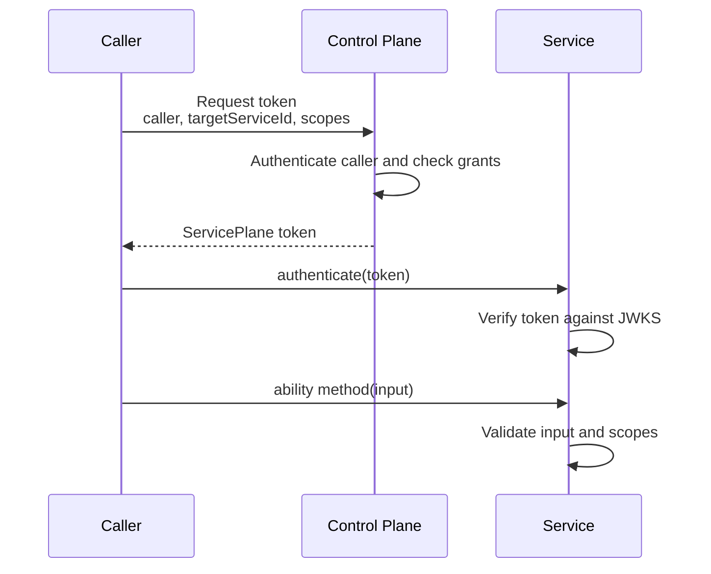

# Auth

Goal: understand how callers are authenticated, how tokens are issued, and where authorization is enforced.

Service Plane uses three layers:

- Hono middleware handles HTTP policy: CORS, logging, request ids, rate limits, and deployment-specific sessions.
- `authenticate(token)` verifies a ServicePlane token inside Cap'n Web.
- The ability wrapper validates method input, checks scopes, calls the handler, and validates output.

## Token Flow



Tokens are short-lived ES256 JWS tokens. The control plane signs them. Services verify them with the control-plane JWKS.

## Generate The STS Signing Secret

Run once:

```sh
node --input-type=module -e "import { generateCapabilitySigningSecret } from 'service-plane/control-plane'; console.log(await generateCapabilitySigningSecret())"
```

Store the output as `STS_SIGNING_SECRET` on the control plane only. Services and callers must not receive this secret.

## Caller Authentication Options

Use the simplest option that matches the deployment boundary.

Cloudflare same-account callers should use private RPC token requests through a service binding:

```ts
controlPlaneRpcTokenRequester({
  binding: env.CONTROL_PLANE,
  callerServiceId: 'workflow-runner',
});
```

External callers that can hold a private key should use JWK caller auth:

```ts
controlPlaneJwkTokenRequester({
  clientId: 'workflow-runner',
  controlPlaneUrl: 'https://plane.example.com',
  keyId: 'workflow-runner-2026-01',
  privateJwk,
});
```

Use HMAC caller auth as a shared-secret fallback:

```ts
controlPlaneHmacTokenRequester({
  clientId: 'workflow-runner',
  controlPlaneUrl: 'https://plane.example.com',
  secret: env.WORKFLOW_RUNNER_SECRET,
});
```

## Context And Identity

`context` is runtime access. It includes the Hono context and environment bindings.

```ts
context.env.ASANA_CONNECTIONS
context.env.CONTROL_PLANE
```

`identity` is who the service is acting for.

```ts
{
  serviceId: 'workflow-runner',
  audience: 'asana',
  scopes: ['asana.tasks.write'],
  tokenId: 'cap_123',
}
```

Keep identity small. It carries Service Plane caller and authorization claims. Product-level user, tenant, or connection context is application-owned; pass it through validated input or project-specific token claims if the service needs it. Store provider credentials in the service's own storage.

## Scope Checks

Method scopes are enforced automatically by the generated ability wrapper.

```ts
abilityMethod({
  input: CreateTaskInput,
  output: CreateTaskOutput,
  scopes: ['asana.tasks.write'],
});
```

Handlers may still call `requireScopes(...)` when they need the identity object inside custom logic.

```ts
import { requireScopes } from 'service-plane/service';

async createTask(input: CreateTaskInput) {
  const identity = requireScopes(this, 'asana.tasks.write');
  // use identity.serviceId or identity.scopes for Service Plane decisions
}
```

Next: [create a service](service-creation.md), [create a control plane](plane-creation.md), and [reference](reference.md).
