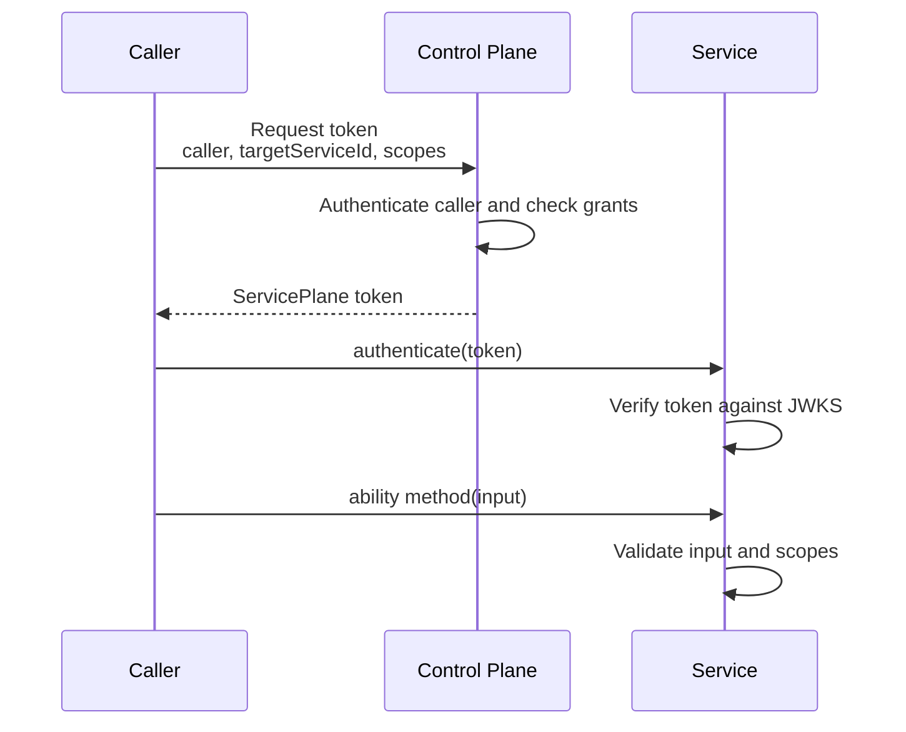
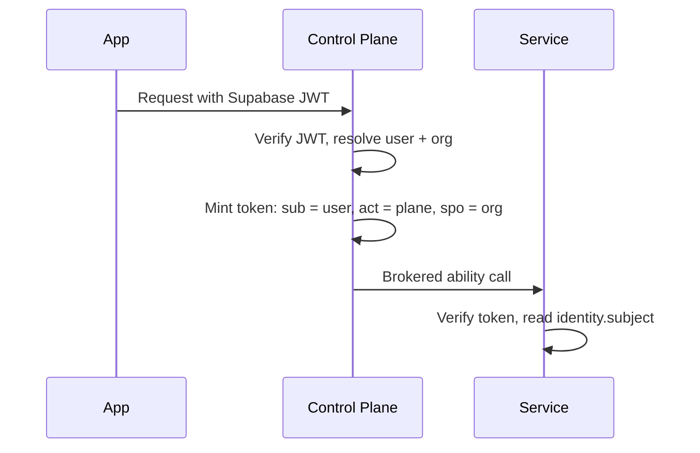

# Auth

Goal: understand how callers are authenticated, how tokens are issued, and where authorization is enforced.

Service Plane uses three layers:

- Hono middleware handles HTTP policy: CORS, logging, request ids, rate limits, and deployment-specific sessions.
- `authenticate(token)` verifies a ServicePlane token inside Cap'n Web.
- The ability wrapper validates method input, checks scopes, calls the handler, and validates output.

## Token Flow



Tokens are short-lived ES256 JWS tokens. The control plane signs them. Services verify them with the control-plane JWKS.

Treat an issued capability token as a bearer credential: use TLS outside private runtime bindings,
never put it in URLs, cookies, or logs, and honor the token endpoint's `Cache-Control: no-store` and
`Pragma: no-cache` response headers. These are the credential-handling principles from
[RFC 6750](https://www.rfc-editor.org/rfc/rfc6750), not a claim that Service Plane implements the
OAuth Bearer protocol.

## Generate The STS Signing Secret

Run once:

```sh
node --input-type=module -e "import { generateCapabilitySigningSecret } from 'service-plane/control-plane'; console.log(await generateCapabilitySigningSecret())"
```

Store the output as `STS_SIGNING_SECRET` on the control plane only. Services and callers must not receive this secret.

## Signing Authority And Authorization Catalog

The control plane keeps two responsibilities apart:

- The **signing authority** owns the signing key, the issuer, the key id, and the public JWKS. It is derived from `signingSecret` alone.
- The **authorization catalog** owns the discovered services, capability scopes, and grants. Building it fetches every configured service's discovery document.

`GET /.well-known/service-plane/jwks.json` answers from the signing authority only. It resolves neither
`services` nor any discovery document, so services can refresh their cached verification keys while a
target service is unavailable. Token issuance and brokering still need both halves and keep failing
closed: an unknown service, scope, or grant is rejected, and an unreachable grant target is a `500`
rather than a token.

`createCapabilitySigningAuthorityFromSigningSecret({ signingSecret, issuer, keyId })` builds that half
directly if you publish JWKS from your own Hono app. `mountCapabilityJwksEndpoint` takes it, and
`mountCapabilityEndpoints` requires an explicit `jwks` provider — passing the issuer there is legal but
re-couples key publication to service discovery, so the choice is yours to make on purpose.

## Caller Authentication Options

Use the simplest option that matches the deployment boundary.

Cloudflare same-account callers should use private RPC token requests through a service binding:

```ts
controlPlaneRpcTokenRequester({
  binding: env.CONTROL_PLANE,
  callerServiceId: 'workflow-runner',
});
```

External callers that can hold a private key should use JWK caller auth:

```ts
controlPlaneJwkTokenRequester({
  clientId: 'workflow-runner',
  controlPlaneUrl: 'https://plane.example.com',
  keyId: 'workflow-runner-2026-01',
  privateJwk,
});
```

Use HMAC caller auth as a shared-secret fallback:

```ts
controlPlaneHmacTokenRequester({
  clientId: 'workflow-runner',
  controlPlaneUrl: 'https://plane.example.com',
  clientSecret: env.WORKFLOW_RUNNER_SECRET,
});
```

The built-in HTTP authenticators follow HTTP authentication grammar: scheme names are
case-insensitive, credentials must contain exactly one scheme and one value, and a `401` response
includes the corresponding `WWW-Authenticate` challenge. The JWK assertion remains a Service
Plane request-bound format rather than an OAuth client assertion.

## Replay Protection

A captured HMAC or JWK token request can be sent twice. Work out what that buys an attacker before
deciding how much machinery to spend on it.

### Risk Assessment

| | |
| --- | --- |
| **Precondition** | The attacker holds the signed request bytes. That means TLS interception, access to retained request logs or headers, or a proxy, sidecar, or gateway in the path. In most of those positions the *response* is also readable — and the response already contains the token, so replay is the slower path to the same thing. |
| **Gain** | One more capability token for the same caller, the same target service, and the same scopes. Issuance still runs the full grant check, so it is a duplicate of a token the caller is entitled to. |
| **Exposure window** | HMAC: the timestamp skew window, default 60s (`maxSkewSeconds`). JWK: the assertion's `exp` plus the skew window, with the lifetime capped at 300s (`maxAssertionTtlSeconds`). Past that the request is rejected on timestamp grounds whether or not a store exists. |
| **Not reachable by replay** | Editing the request — method, path, body hash, client id, and request id are all signed. Retargeting to another service, widening scopes, impersonating another caller, or extending the token TTL past the plane's maximum. |
| **Residual risk with no store** | A handful of extra tokens inside a ≤60s window, each capped at the plane's token TTL, each carrying scopes the caller already holds. |

**Assessment: low.** A replay store narrows an already-narrow window and does not lower the ceiling
on what an attacker obtains. So replay protection here is **defense in depth**. The controls that do
the real work are always on and need no configuration:

- TLS between caller and plane.
- Request binding: the signature covers method, path, body hash, client id, and request id.
- The timestamp skew window and, for JWK, the assertion lifetime.
- Short capability-token TTLs, and grant checks at issuance.

The cheapest way to shrink the window further needs no infrastructure at all: lower `maxSkewSeconds`
(to the tightest value your clock discipline tolerates) and `maxAssertionTtlSeconds`. Do that before
reaching for a store.

Cases where a store does earn its cost: request headers are retained in logs or an APM while
responses are not; a component can replay a request it could not observe the response to; one-time-use
assertions are a compliance requirement; or duplicate token issuance is itself an audit finding.

### Precedent

This baseline — bind the request, bound the window, treat replay reservation as optional hardening —
is where the specifications and the large deployments land. Cited as precedent for the shape of the
control, not as a compliance claim:

- **RFC 7523 §3** (JWT profile for OAuth 2.0 client authentication) makes it explicitly optional: an
  authorization server "MAY ensure that JWTs are not replayed by maintaining the set of used `jti`
  values for the length of time for which the JWT would be considered valid". A MAY, and bounded to
  the assertion's own validity window — which is exactly the TTL Service Plane passes to `reserve()`.
- **RFC 9449 §11.1** (DPoP) treats proof replay the same way: a server *can* store each proof's `jti`
  for the window in which that proof would still be accepted. Where DPoP wants a stronger guarantee it
  does not reach for a bigger cache, it adds a server-issued nonce.
- **RFC 9421** (HTTP Message Signatures) keeps `nonce` an optional signature parameter and leans on
  `created` / `expires` for replay windows, leaving nonce tracking to verifiers that need it.
- **AWS SigV4** ships no replay store at all. A signed request is accepted inside a 5-minute skew
  window, on TLS, at AWS's scale — the same trade this package makes by default.
- **Stripe webhooks** sign with HMAC and a timestamp, default a 5-minute tolerance, and hand
  duplicate suppression to the consumer as idempotent event handling rather than guaranteeing
  exactly-once delivery themselves.

`replayCache` is therefore **optional and off by default**. There is one supported configuration on
each side of that choice:

| Configuration | Guarantee |
| --- | --- |
| No `replayCache` (default) | A captured request is reusable until its skew window or assertion lifetime expires. Horizontal scaling is unaffected. |
| A shared store | Exactly one copy of a request wins, regardless of which replica or isolate receives it. |

There is no third option on purpose. A process- or isolate-local cache is not offered, because it
would look like protection while only the replica that saw the first copy rejects the second, with
nothing reporting the gap. Nor is a store with a separate read and write: two replicas can both
observe "absent" before either writes, and that failure is invisible too. `replayCache` accepts one
operation, `reserve(key, ttlSeconds)`, and it must be atomic and reachable by every replica.

Configuring a store is opting into the guarantee, so it is enforced without further settings:

```ts
hmacServiceClientAuth({
  clients,
  replayCache: redisReplayCache(env.REDIS_URL),
});
```

### Two Node Replicas

Both replicas run the same image behind a load balancer and share one Redis. `SET key value NX EX ttl`
is the atomic reservation: it succeeds only if the key does not exist.

```ts
function redisReplayCache(redis: { set(...args: string[]): Promise<string | null> }): ServicePlaneReplayCache {
  return {
    // NX makes the write conditional; EX bounds it. One command, so no read/write gap to race.
    async reserve(key, ttlSeconds) {
      return (await redis.set(key, '1', 'NX', 'EX', String(ttlSeconds))) === 'OK';
    },
  };
}

const authenticateCaller = jwkServiceClientAuth({
  clients,
  replayCache: redisReplayCache(redis),
});
```

Replica A accepts the request and reserves the key. Replica B receives the replay, finds the key
present, and answers `401`. Only the replay cache is shared: signing configuration is identical on
both replicas, but each keeps its own issuer, registry, and OpenAPI caches.

### Two Cloudflare Isolates

Several isolates may serve one Worker deployment, in different locations, created and evicted at any
time. An isolate-local `Map` cannot see a sibling's reservations. Route every replay key to one
Durable Object instead — `idFromName(key)` gives consistent routing, and the object's single-threaded
storage gives atomicity:

```ts
function durableObjectReplayCache(namespace: DurableObjectNamespace): ServicePlaneReplayCache {
  return {
    async reserve(key, ttlSeconds) {
      const stub = namespace.get(namespace.idFromName(key));
      const response = await stub.fetch('https://replay.internal/reserve', {
        body: JSON.stringify({ key, ttlSeconds }),
        method: 'POST',
      });
      return (await response.json<{ reserved: boolean }>()).reserved;
    },
  };
}
```

Cloudflare KV is not suitable here: its reads are eventually consistent, so two isolates can both
read "absent" for a key one of them has already written. Use KV for discovery snapshots and OpenAPI
documents, not for replay reservations.

### When The Store Is Unavailable

Redis restarts. Durable Objects have bad minutes. If `reserve()` throws, the request is refused with
`503` and `{ "error": "Service-Plane replay verification unavailable" }`, and a
`replay_cache_unavailable` event is logged. There is no `401` and no `WWW-Authenticate` challenge:
the caller's credentials were valid and re-signing would not help.

This is not configurable, and the trade-off is worth being explicit about. Wiring a store is a
statement that replay must not happen, so serving unprotected would quietly break that statement —
and a switch to permit it is a switch that gets flipped once during an incident and never flipped
back. The cost is real: **the replay store becomes a hard dependency of token issuance**, so a store
outage is a token outage, and every brokered call fails with it. Give it the same uptime budget,
health checks, and alerting as the plane itself.

If that dependency is not one you want, do not configure a store. The default is a documented
baseline, not a broken state.

### Out Of Scope

Cloudflare same-account `controlPlaneRpcTokenRequester` calls are not part of this problem. The
caller identity is pinned by the private service-binding entrypoint and no HMAC or JWK HTTP assertion
is sent, so there is nothing to capture and replay.

Issued capability tokens are a separate problem, and a larger one — replay protection is about
re-using a caller-authentication *request*, and does nothing about a stolen token. That is what
sender-constrained tokens are for.

## Sender-Constrained Tokens

A capability token is a bearer credential by default: whoever holds the bytes can use it. So the
attacker in the replay risk assessment who captured the *response* rather than the request wins
outright, no replay needed — and so does anyone who reads the plane's logs, a token cache, or the plane
itself.

Binding fixes that. RFC 7800 defines the `cnf` (confirmation) claim: the issuer names a key the
presenter must prove it holds. Service Plane uses the `jkt` confirmation method — the RFC 7638 SHA-256
thumbprint of the caller's public JWK, as registered by RFC 9449 (DPoP).

**JWK callers get this automatically, with no configuration and no new secrets.** The plane already
holds the caller's public key and already verifies a signature on every token request, so it stamps the
thumbprint of the key that actually authenticated:

```json
{ "iss": "control-plane", "sub": "workflow-runner", "aud": "asana", "cnf": { "jkt": "NzbLsXh8..." } }
```

The caller then signs a short-lived proof when it opens a session:

```ts
const api = await abilitySession<AbilityRpc<typeof asanaTasks>>({
  abilityId: 'asana.tasks',
  callerServiceId: 'workflow-runner',
  targetServiceId: 'asana',
  scopes: ['asana.tasks.write'],
  requestToken,
  // Same private key the token requester authenticates with.
  proveTokenPossession: jwkCapabilityProofSigner({ privateJwk }),
  transport: websocketRpc('wss://asana.example.com/rpc/asana.tasks'),
});
```

Each proof is bound to the token (by hash), the target service, and the ability, and carries the public
key so the service needs no key distribution. The service thumbprints that key, compares it to
`cnf.jkt`, *then* checks the signature — so substituting a different key fails the comparison, and
substituting the bound key without re-signing fails the signature.

**Services enforce this with no configuration.** A token carrying `cnf` is rejected unless a matching
proof arrives, because the requirement travels in the token rather than in local config. A caller
cannot downgrade a sender-constrained token to a bearer token by omitting the proof, and a service
cannot forget to check.

What this buys beyond replay protection: a token minted for one caller is useless to everyone else,
**including to a compromised control plane**. The plane can still mint tokens, but it cannot present
one.

### Where It Applies

| Path | Binding |
| --- | --- |
| JWK caller → token endpoint → service | Automatic. This is where a token leaves the plane. |
| HMAC caller | None. A shared secret has no key to confirm; use JWK caller auth if you want binding. |
| Brokered calls (`/rpc/broker`) | Not applicable. The broker mints the token and uses it on its own leg to the service — the caller never receives it. Ingress plus the signed `spb` claim already restricts those tokens to brokered use. |
| Cloudflare service bindings | Unnecessary. Identity is pinned by the binding entrypoint and no token crosses a network. |

### Limits

The proof is **session-scoped**, not per-call: Cap'n Web sessions are long-lived, so one proof is signed
when the session opens. The guarantee is "the caller held the key when this session opened", not "on
every method call".

Proofs have their own 60-second freshness window (plus skew) for the same reason token requests do —
a proof is itself a signed artifact. It is bound to one token, one service, and one ability, so a
captured proof cannot be pointed anywhere else, but binding narrows exposure rather than eliminating it.

## Context And Identity

`context` is runtime access. It includes the Hono context and environment bindings.

```ts
context.env.ASANA_CONNECTIONS
context.env.CONTROL_PLANE
```

`identity` is who the service is acting for.

```ts
{
  serviceId: 'workflow-runner',
  audience: 'asana',
  scopes: ['asana.tasks.write'],
  tokenId: 'cap_123',
  subject: { id: 'user-7', orgId: 'org-42' }, // only on delegated (user-brokered) calls
}
```

Keep identity small. It carries Service Plane caller and authorization claims, plus the delegated end-user subject on user-brokered calls. Any other product-level connection context is application-owned; pass it through validated method input if the service needs it. Store provider credentials in the service's own storage.

## Subject Delegation

When the control plane brokers a call for an authenticated end user, the token uses RFC 8693's `act` actor-claim semantics: `sub` carries the end user and `act.sub` names the acting service. The `spo` organization claim is Service Plane-specific. Services read the user as `identity.subject`, while `identity.serviceId` stays the acting service.

Service Plane does not expose the RFC 8693 token-exchange protocol. `/.well-known/service-plane/capability-token` is a package-specific JSON capability endpoint, and `scp`, `spo`, and `spb` are Service Plane-specific claims. The established claim names stay the same; only `act` borrows RFC 8693's delegation relationship.

The flow with an application identity provider such as Supabase:



Return the resolved user from the broker (or MCP) caller resolver:

```ts
const plane = new ServicePlaneControlPlane({
  broker: {
    caller: async (context) => {
      const user = await verifySupabaseJwt(context); // application-owned verification
      if (!user) {
        return context.json({ error: 'Unauthorized' }, 401, {
          'WWW-Authenticate': 'Bearer realm="service-plane"',
        });
      }
      return { id: user.id, kind: 'user', orgId: user.orgId };
    },
  },
  // ...
});
```

Every capability token brokered for that caller then carries `sub: 'user-7'`, `act: { sub: 'control-plane' }`, and `spo: 'org-42'`, and handlers see the user on the verified identity:

```ts
async createTask(input: CreateTaskInput) {
  const identity = requireScopes(this, 'asana.tasks.write');
  if (identity.subject) audit.log({ userId: identity.subject.id, orgId: identity.subject.orgId });
}
```

Boundaries to keep in mind:

- The subject is delegation the control plane vouches for. It rides the same issuer/JWKS trust chain as every other claim, so services may rely on it for auditing and per-user decisions.
- The subject does not replace scope or grant checks. Ability authorization stays with scopes, grants, and ingress. Tenancy authorization stays with the service that owns the data.
- Only control-plane code asserts subjects: the broker caller resolver or direct `issueCapabilityToken({ subject, ... })` calls. The HTTP token endpoint rejects caller-supplied `subject` fields, and the shipped token requesters (`controlPlaneHmacTokenRequester`, `controlPlaneJwkTokenRequester`, `controlPlaneRpcTokenRequester`) refuse to send one, so an authenticated service cannot claim it acts for an arbitrary user. The `subject` option on `createCapabilityTokenProvider` therefore only works with a `requestToken` that calls the issuer in-process.
- Direct `issueCapabilityToken({ subject, ... })` mints a non-brokered token. For a target with `ingress` required, delegate through the broker instead — it selects `issueBrokeredCapabilityToken` automatically; a directly issued token is rejected by the ingress check.
- Tokens delegated to a subject are cached per subject. `capabilityTokenCacheKey` includes the subject, so a token minted for one user is never served for another.

## Forwarded Connection Info

The plane terminates the client connection; the service only ever sees the plane. A service can therefore learn where a call came from only if the plane forwards it — and forwarding is opt-in, because it is an unsigned assertion.

Wire the resolver on the broker and MCP mounts. `getConnInfo` is runtime-specific in Hono, so the application supplies the right one:

```ts
import { getConnInfo } from 'hono/cloudflare-workers'; // or 'hono/deno', '@hono/node-server/conninfo', ...

new ServicePlaneControlPlane({
  broker: { caller: resolveCaller, connInfo: (c) => getConnInfo(c) },
  mcp: { caller: resolveCaller, connInfo: (c) => getConnInfo(c) },
  // ...
});
```

The plane then forwards it on every outbound call, exactly where it forwards the request id: the `X-Service-Plane-Conn-Info` header for HTTP-batch and service-binding transports, the `conn_info` query parameter for WebSocket, and the `connInfo` field on `connectAbility(...)` for native binding RPC.

Services receive it as `connInfo` on the ability handler factory input:

```ts
handler: ({ connInfo, identity }) => new TasksHandler(identity, connInfo?.remote.address),
```

Rules the package enforces:

- **Ingress is required.** Handlers see `connInfo` only when the service is configured with `ingress` **and** the token is brokered (`brokerServiceId` is a signed claim only the control plane can mint). Without ingress the service has no proof its peer is the plane, so a forwarded value would be indistinguishable from one a direct caller invented — it is dropped.
- **The shape is validated on both ends.** Only Hono's `ConnInfo` fields survive, with a bounded address charset, a port in range, and the `tcp`/`udp` and `IPv4`/`IPv6` enumerations. Anything else is dropped rather than passed through.
- **It is not in the token.** Connection info is request-scoped while capability tokens are cached and reused; putting an address in a claim would partition the token cache per client and write client PII into it.

Treat it as advisory, for audit records and logs. It is not signature-verified, so it must never gate access — authorization stays with scopes, grants, and ingress. Per-client rate limiting belongs at the plane, which is where the connection actually terminates.

## Scope Checks

Method scopes are enforced automatically by the generated ability wrapper.

```ts
abilityMethod({
  input: CreateTaskInput,
  output: CreateTaskOutput,
  scopes: ['asana.tasks.write'],
});
```

Handlers may still call `requireScopes(...)` when they need the identity object inside custom logic.

```ts
import { requireScopes } from 'service-plane/service';

async createTask(input: CreateTaskInput) {
  const identity = requireScopes(this, 'asana.tasks.write');
  // use identity.serviceId or identity.scopes for Service Plane decisions
}
```

Next: [create a service](service-creation.md), [create a control plane](plane-creation.md), and [reference](reference.md).
