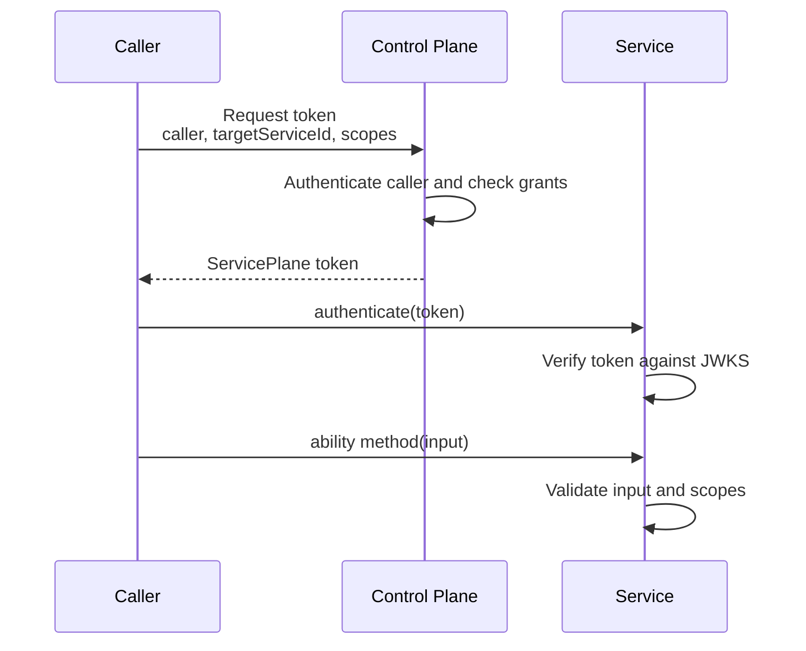
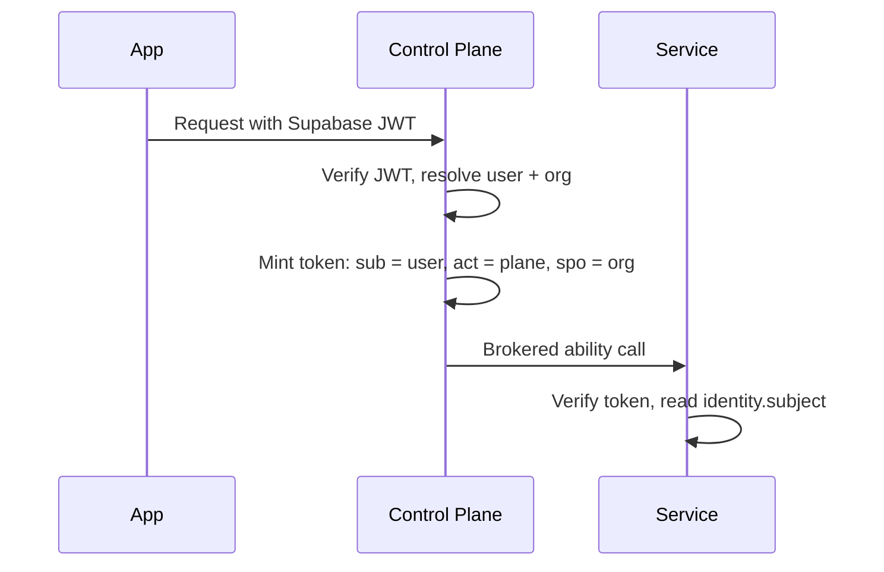

# Auth

Goal: understand how callers are authenticated, how tokens are issued, and where authorization is enforced.

Service Plane uses three layers:

- Hono middleware handles HTTP policy: CORS, logging, request ids, rate limits, and deployment-specific sessions.
- `authenticate(token)` verifies a ServicePlane token inside Cap'n Web.
- The ability wrapper validates method input, checks scopes, calls the handler, and validates output.

## Token Flow



Tokens are short-lived ES256 JWS tokens. The control plane signs them. Services verify them with the control-plane JWKS.

## Generate The STS Signing Secret

Run once:

```sh
node --input-type=module -e "import { generateCapabilitySigningSecret } from 'service-plane/control-plane'; console.log(await generateCapabilitySigningSecret())"
```

Store the output as `STS_SIGNING_SECRET` on the control plane only. Services and callers must not receive this secret.

## Caller Authentication Options

Use the simplest option that matches the deployment boundary.

Cloudflare same-account callers should use private RPC token requests through a service binding:

```ts
controlPlaneRpcTokenRequester({
  binding: env.CONTROL_PLANE,
  callerServiceId: 'workflow-runner',
});
```

External callers that can hold a private key should use JWK caller auth:

```ts
controlPlaneJwkTokenRequester({
  clientId: 'workflow-runner',
  controlPlaneUrl: 'https://plane.example.com',
  keyId: 'workflow-runner-2026-01',
  privateJwk,
});
```

Use HMAC caller auth as a shared-secret fallback:

```ts
controlPlaneHmacTokenRequester({
  clientId: 'workflow-runner',
  controlPlaneUrl: 'https://plane.example.com',
  secret: env.WORKFLOW_RUNNER_SECRET,
});
```

## Context And Identity

`context` is runtime access. It includes the Hono context and environment bindings.

```ts
context.env.ASANA_CONNECTIONS
context.env.CONTROL_PLANE
```

`identity` is who the service is acting for.

```ts
{
  serviceId: 'workflow-runner',
  audience: 'asana',
  scopes: ['asana.tasks.write'],
  tokenId: 'cap_123',
  subject: { id: 'user-7', orgId: 'org-42' }, // only on delegated (user-brokered) calls
}
```

Keep identity small. It carries Service Plane caller and authorization claims, plus the delegated end-user subject on user-brokered calls. Any other product-level connection context is application-owned; pass it through validated method input if the service needs it. Store provider credentials in the service's own storage.

## Subject Delegation

When the control plane brokers a call for an authenticated end user, the token follows RFC 8693 delegation semantics: `sub` carries the end user, the `act` (actor) claim names the acting service, and `spo` carries the user's org. Services read the user as `identity.subject`, while `identity.serviceId` stays the acting service.

The flow with an application identity provider such as Supabase:



Return the resolved user from the broker (or MCP) caller resolver:

```ts
const plane = new ServicePlaneControlPlane({
  broker: {
    caller: async (context) => {
      const user = await verifySupabaseJwt(context); // application-owned verification
      if (!user) return undefined;
      return { id: user.id, kind: 'user', orgId: user.orgId };
    },
  },
  // ...
});
```

Every capability token brokered for that caller then carries `sub: 'user-7'`, `act: { sub: 'control-plane' }`, and `spo: 'org-42'`, and handlers see the user on the verified identity:

```ts
async createTask(input: CreateTaskInput) {
  const identity = requireScopes(this, 'asana.tasks.write');
  if (identity.subject) audit.log({ userId: identity.subject.id, orgId: identity.subject.orgId });
}
```

Boundaries to keep in mind:

- The subject is delegation the control plane vouches for. It rides the same issuer/JWKS trust chain as every other claim, so services may rely on it for auditing and per-user decisions.
- The subject does not replace scope or grant checks. Ability authorization stays with scopes, grants, and ingress. Tenancy authorization stays with the service that owns the data.
- Only control-plane code asserts subjects: the broker caller resolver or direct `issueCapabilityToken({ subject, ... })` calls. The HTTP token endpoint rejects caller-supplied `subject` fields, and the shipped token requesters (`controlPlaneHmacTokenRequester`, `controlPlaneJwkTokenRequester`, `controlPlaneRpcTokenRequester`) refuse to send one, so an authenticated service cannot claim it acts for an arbitrary user. The `subject` option on `createCapabilityTokenProvider` therefore only works with a `requestToken` that calls the issuer in-process.
- Direct `issueCapabilityToken({ subject, ... })` mints a non-brokered token. For a target with `ingress` required, delegate through the broker instead — it selects `issueBrokeredCapabilityToken` automatically; a directly issued token is rejected by the ingress check.
- Tokens delegated to a subject are cached per subject. `capabilityTokenCacheKey` includes the subject, so a token minted for one user is never served for another.

## Scope Checks

Method scopes are enforced automatically by the generated ability wrapper.

```ts
abilityMethod({
  input: CreateTaskInput,
  output: CreateTaskOutput,
  scopes: ['asana.tasks.write'],
});
```

Handlers may still call `requireScopes(...)` when they need the identity object inside custom logic.

```ts
import { requireScopes } from 'service-plane/service';

async createTask(input: CreateTaskInput) {
  const identity = requireScopes(this, 'asana.tasks.write');
  // use identity.serviceId or identity.scopes for Service Plane decisions
}
```

Next: [create a service](service-creation.md), [create a control plane](plane-creation.md), and [reference](reference.md).
