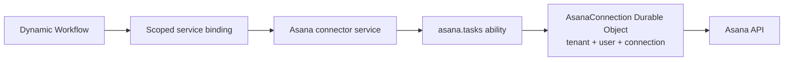

# Cloudflare

Goal: use Service Plane with Workers, Service Bindings, Durable Objects, and Dynamic Workers.

Cloudflare-to-Cloudflare calls should use bindings when possible. Use HTTP-batch for self-hosted services and WebSocket for explicit long-lived sessions.

## Local Worker-To-Worker Calls

For local development, the caller can request a token through a private binding and call the service
binding directly. Production services should enable ingress and route the caller through the broker.

```ts
import {
  abilitySession,
  cloudflareServiceBindingRpc,
  controlPlaneRpcTokenRequester,
  type AbilityRpc,
} from 'service-plane/service';
import { asanaTasks } from './abilities';

const asana = await abilitySession<AbilityRpc<typeof asanaTasks>>({
  abilityId: 'asana.tasks',
  callerServiceId: 'workflow-runner',
  targetServiceId: 'asana',
  scopes: ['asana.tasks.write'],
  requestToken: controlPlaneRpcTokenRequester({
    binding: env.CONTROL_PLANE,
    callerServiceId: 'workflow-runner',
  }),
  transport: cloudflareServiceBindingRpc(env.ASANA),
});
```

`cloudflareServiceBindingRpc(...)` sends HTTP-batch RPC through the binding and defaults to
`/rpc/<abilityId>`. This direct transport is for ingress-disabled local/development setups;
production ingress routes through the broker.

## Native Binding RPC

When the service binding exposes `connectAbility(...)`, native binding RPC is the lowest-overhead
session transport. Direct caller use is for ingress-disabled local/development setups; in production,
the control-plane broker can use the same binding with a brokered token.

Expose both Hono HTTP routes and the native method from a `WorkerEntrypoint`:

```ts
import { WorkerEntrypoint } from 'cloudflare:workers';

const service = new ServicePlaneService<{ Bindings: Env }>({
  // ...
});

export default class AsanaService extends WorkerEntrypoint<Env> {
  fetch(request: Request) {
    return service.fetch(request, this.env, this.ctx);
  }

  connectAbility(input: { abilityId: string; requestId?: string; token: string }) {
    return service.connectAbility(input, this.env);
  }
}
```

```ts
transport: cloudflareNativeRpc(env.ASANA)
```

Wrap a direct native `abilitySession` in `using`, or call `disposeAbilitySession` in `finally`; the
session caches its `connectAbility` target and disposal releases that target.

For the control plane to use the same path, register the binding as the endpoint's `abilityRpc`:

```ts
cloudflareServiceBinding({ abilityRpc: env.ASANA, binding: env.ASANA, id: 'asana' });
```

This is always explicit — a service-binding stub answers any property access with a callable RPC
proxy, so the presence of `connectAbility` proves nothing about the target.

Both transports use the same ability wrapper: token verification, method scopes, input validation, handler call, and output validation.

Native binding calls do not traverse the Hono middleware chain, but the ability handler still
receives a real Hono `Context` with the ability's POST path, supplied bindings, and propagated
request id. No HTTP execution context is fabricated for the RPC call.

Ingress-protected services reject native binding RPC when the caller uses a normal non-brokered capability token.

For private token requests, expose a caller-pinned control-plane entrypoint instead of trusting a
caller id supplied over RPC:

```ts
import { WorkerEntrypoint } from 'cloudflare:workers';
import type { IssueCapabilityTokenInput } from 'service-plane/control-plane';

const plane = new ServicePlaneControlPlane<{ Bindings: Env }>({
  // ...
});

export default class WorkflowRunnerPlane extends WorkerEntrypoint<Env> {
  fetch(request: Request) {
    return plane.fetch(request, this.env, this.ctx);
  }

  issueCapabilityToken(input: IssueCapabilityTokenInput) {
    const { callerServiceId, ...request } = input;
    return plane.issueCapabilityTokenForCaller(
      'workflow-runner',
      { ...request, callerServiceId },
      this.env,
    );
  }
}
```

Give that entrypoint binding only to `workflow-runner`. `controlPlaneRpcTokenRequester` can call
its `issueCapabilityToken` method directly; the adapter pins and verifies the deployment-owned
identity before the control plane checks grants.

## Durable Objects For User Connections

For connector services, use a normal Worker as the service and one Durable Object per user connection.



The service ability stays stateless. The Durable Object owns provider state:

- OAuth access and refresh tokens
- provider-specific config
- cursors and sync checkpoints
- per-connection rate-limit state
- webhook dedupe state

Use `identity.subject` (when the control plane delegates the call to an end user) together with validated input fields such as `connectionId` to route to the Durable Object. Do not pass provider credentials through Dynamic Workflow metadata or Service Plane identity.

## Dynamic Workers And Workflows

The loader can inject a small binding into the dynamic workflow.

```ts
await env.ASANA.createTask({
  connectionId: 'conn_123',
  name: 'Follow up',
  projectId: 'proj_456',
});
```

Behind that binding:

1. The loader fixes the application-level tenant, user, connection, and allowed scopes.
2. The binding requests a ServicePlane token.
3. The binding opens an ability session to `asana.tasks`.
4. The Asana service routes the call to the right Durable Object.

This keeps workflow code simple and keeps credentials outside user-authored workflow code. Service Plane secures the plane-to-service call and can delegate it to an end-user subject per RFC 8693; the implementor owns any further user and tenant context in the validated input.

## Sharing The Discovery Cache Across Isolates

The plane caches the discovered service catalog by default, in memory. On Cloudflare that means **per isolate**: each one resolves the catalog once and then serves it for the TTL, but nothing is shared between isolates and each warms up on its own.

That is already most of the benefit — it turns a fan-out on every request into one per isolate per TTL. A shared store only adds the last step: isolates stop warming up independently.

### Layering a shared store behind the in-memory one

The mistake to avoid is putting the shared store *in front*. A KV or Durable Object read is a network hop; doing it on every request replaces a cheap local lookup with a remote one. Put it **behind** the in-memory cache instead, so the hop happens only when the local copy is missing:

```ts
import { memoryRegistryCache, type RegistryCache } from 'service-plane/control-plane';

function tieredRegistryCache(local: RegistryCache, shared: RegistryCache, promoteTtlSeconds = 5): RegistryCache {
  return {
    async get(key) {
      const near = await local.get(key);
      if (near) return near;            // almost always ends here
      const far = await shared.get(key);
      // Promoted for a short window, not a fresh full TTL. `RegistryCache.get` does not report how
      // much life the shared entry had left, so giving the local copy the same TTL lets it outlive
      // the entry it came from — with two 30s stores a catalog could stay stale for nearly 60s.
      // A short promotion keeps the local layer doing its job without compounding staleness.
      if (far) await local.set(key, far, promoteTtlSeconds);
      return far;
    },
    getStale: (key) => shared.getStale?.(key),
    async set(key, value, ttlSeconds) {
      await Promise.all([local.set(key, value, ttlSeconds), shared.set(key, value, ttlSeconds)]);
    },
  };
}
```

A warm isolate answers from memory in microseconds. A cold one reads the shared snapshot instead of asking every service. The fan-out is paid by whichever isolates miss both layers — the plane coalesces concurrent fills *within* a process, but there is no distributed lock across isolates, so several cold isolates racing an empty shared store can each resolve once before the first write lands. That is a bounded burst at cold start, not the steady state; a distributed single-flight would need an atomic reservation in the shared store and is not worth its complexity here.

### A Durable Object as the shared store

```ts
import { DurableObject } from 'cloudflare:workers';
import type { RegistryCache, ServiceDiscoverySnapshot } from 'service-plane/control-plane';

type Entry = { expiresAt: number; value: ServiceDiscoverySnapshot };

export class DiscoveryCacheObject extends DurableObject {
  async read(key: string, allowStale: boolean): Promise<ServiceDiscoverySnapshot | undefined> {
    const entry = await this.ctx.storage.get<Entry>(key);
    if (!entry) return undefined;
    // Expired entries stay readable as stale: that is what lets the registry revalidate with
    // `if-none-match` and get 304s back instead of full documents.
    return allowStale || Date.now() < entry.expiresAt ? entry.value : undefined;
  }

  async write(key: string, value: ServiceDiscoverySnapshot, ttlSeconds: number): Promise<void> {
    await this.ctx.storage.put<Entry>(key, { expiresAt: Date.now() + ttlSeconds * 1000, value });
  }
}

export function durableObjectRegistryCache(
  namespace: DurableObjectNamespace<DiscoveryCacheObject>,
  name = 'discovery',
): RegistryCache {
  const stub = () => namespace.get(namespace.idFromName(name));
  return {
    get: (key) => stub().read(key, false),
    getStale: (key) => stub().read(key, true),
    set: (key, value, ttlSeconds) => stub().write(key, value, ttlSeconds),
  };
}
```

The snapshot is plain JSON, so it crosses the Durable Object RPC boundary unchanged. Durable Object storage has no TTL of its own, which is why the entry carries its own `expiresAt`.

**Use a Durable Object here only behind the in-memory layer.** One object serializes every access and sits in one location, so making it the first stop for a hot route builds a global bottleneck exactly where throughput matters. KV is the easier shared store for this — reads are edge-cached, and its eventual consistency only delays a new ability becoming grantable. Nothing it can delay *loosens* enforcement, `access` included: the caller's access class rides the token and the service checks it against its own definition, so an ability tightened to `access: 'service'` refuses a plane-class caller from the moment it deploys, however far behind the cached catalog is.

```ts
new ServicePlaneControlPlane({
  discoveryCache: {
    // The call path — issuance, broker, MCP — wants the fast local layer in front.
    token: tieredRegistryCache(memoryRegistryCache(), durableObjectRegistryCache(env.DISCOVERY_CACHE)),
    // OpenAPI is cold and infrequent; a plain shared store is fine.
    openapi: kvRegistryCache(env.SERVICE_DISCOVERY_KV),
  },
  // ...
});
```

## Caching Metadata At The Edge

Cloudflare [Workers Cache](https://blog.cloudflare.com/workers-cache/) puts the cache in front of the Worker: on a hit the Worker does not execute at all. Service Plane's metadata GET routes are the natural fit — the service discovery document, the aggregated `/openapi.json`, and the JWKS document. Ability RPC (POST), the broker, and MCP sessions are never cache-eligible.

Enable the cache in the Worker config and turn on the `httpCache` flag:

```jsonc
// wrangler.jsonc
{ "cache": { "enabled": true } }
```

```ts
const service = new ServicePlaneService({
  // ...
  httpCache: true, // Cache-Control: public, max-age=30, stale-while-revalidate=300
});

const plane = new ServicePlaneControlPlane({
  // ...
  httpCache: { maxAgeSeconds: 60, tags: ['env:prod'] },
});
```

With the flag on, the routes emit `Cache-Control` plus `Cache-Tag` headers (`service-plane`, `service-plane:discovery`, `service-plane:service:<id>`, `service-plane:openapi`, `service-plane:jwks`). All routes also emit `ETag`s, so the plane's conditional discovery fetches (`If-None-Match`) revalidate as cheap 304s. Without the flag, no cache headers are emitted and behavior is unchanged.

### Staleness After A Service Deploy

Two caches now sit between a deployed service and what callers see: the plane's registry snapshot (`DEFAULT_REGISTRY_CACHE_TTL_SECONDS`, 30s) and the edge cache in front of the service's discovery route. Worst-case convergence after a deploy that changes abilities, RPC paths, or scopes is roughly `edge max-age + registry TTL` (about a minute on defaults; `stale-while-revalidate` refreshes in the background, so hits stay fast without extending the window further).

During that window, staleness fails closed, not open:

- The service verifies every token against its **current** definition. A token minted from a stale snapshot with a removed or renamed scope is rejected with 403; a call brokered to a removed RPC path gets a 404; an ability the deploy tightened to `access: 'service'` refuses a plane-class caller even while the plane still brokers it. Nothing stale grants access.
- A removed published ability can linger in a cached `/openapi.json`; callers get errors until the caches converge. A newly added ability is simply invisible until then.
- A grant that still names a scope the deployed service renamed or dropped refuses tokens for that service alone. The rest of the plane keeps issuing and brokering, and the refusal stays the specific `Unknown Service-Plane capability scope` error so it reads as configuration drift, not a permissions bug.

To converge immediately instead of waiting out the window, purge by tag from a deploy hook:

```ts
// In the Worker fronting the service (or via the Cloudflare purge API):
await ctx.cache.purge({ tags: ['service-plane:service:asana'] });
// On the plane, after the registry cache TTL (or a registry cache purge):
await ctx.cache.purge({ tags: ['service-plane:openapi'] });
```

Keep JWKS key rotation overlapping: publish a new key alongside the old one for at least the edge `max-age` **plus `stale-while-revalidate`** plus the services' JWKS cache TTL before signing with it, or purge `service-plane:jwks` on rotation. The `stale-while-revalidate` term is the one usually forgotten — an edge honouring it serves the old-only document for that long after `max-age` expires. Full runbook, including every overlap-window term and rollback: [Rotate The Signing Key](auth.md#rotate-the-signing-key).

## When To Use WebSockets

Use WebSocket for long-lived or interactive sessions, such as MCP-style tool sessions or realtime updates. Streaming ability methods also need a session transport — on Cloudflare prefer native binding RPC, which streams without a WebSocket (see [Streaming](streaming.md)).

Do not use WebSocket as the default Worker-to-Worker transport. Bindings are simpler for request/response work and do not need connection lifecycle handling. Note that Durable Objects holding Cap'n Web sessions bill duration for the whole connection — Cap'n Web cannot use the WebSocket Hibernation API yet (capnweb#36). Full decision guide: [Choosing A Transport](transports.md).

Next: [architecture](architecture.md), [auth](auth.md), and [Node.js](nodejs.md).
