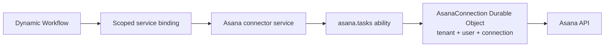

# Cloudflare

Goal: use Service Plane with Workers, Service Bindings, Durable Objects, and Dynamic Workers.

Cloudflare-to-Cloudflare calls should use bindings when possible. Use HTTP-batch for self-hosted services and WebSocket for explicit long-lived sessions.

## Worker-To-Worker Calls

The caller asks the control plane for a token through a private binding, then calls the service through a service binding.

```ts
import {
  abilitySession,
  cloudflareServiceBindingRpc,
  controlPlaneRpcTokenRequester,
  type AbilityRpc,
} from 'service-plane/service';
import { asanaTasks } from './abilities';

const asana = await abilitySession<AbilityRpc<typeof asanaTasks>>({
  abilityId: 'asana.tasks',
  callerServiceId: 'workflow-runner',
  targetServiceId: 'asana',
  scopes: ['asana.tasks.write'],
  requestToken: controlPlaneRpcTokenRequester({
    binding: env.CONTROL_PLANE,
    callerServiceId: 'workflow-runner',
  }),
  transport: cloudflareServiceBindingRpc(env.ASANA),
});
```

`cloudflareServiceBindingRpc(...)` sends HTTP-batch RPC through the binding and defaults to `/rpc/<abilityId>`. If the target service enables ingress protection, route calls through the control-plane broker so the token carries the signed broker claim.

## Native Binding RPC

When the service binding exposes `connectAbility(...)`, use native binding RPC instead of HTTP-batch unless the service enables ingress protection for direct callers.

```ts
transport: cloudflareNativeRpc(env.ASANA)
```

Both transports use the same ability wrapper: token verification, Zod validation, method scopes, handler call, and output validation.

Ingress-protected services reject native binding RPC when the caller uses a normal non-brokered capability token.

## Durable Objects For User Connections

For connector services, use a normal Worker as the service and one Durable Object per user connection.



The service ability stays stateless. The Durable Object owns provider state:

- OAuth access and refresh tokens
- provider-specific config
- cursors and sync checkpoints
- per-connection rate-limit state
- webhook dedupe state

Use `identity.subject` (when the control plane delegates the call to an end user) together with validated input fields such as `connectionId` to route to the Durable Object. Do not pass provider credentials through Dynamic Workflow metadata or Service Plane identity.

## Dynamic Workers And Workflows

The loader can inject a small binding into the dynamic workflow.

```ts
await env.ASANA.createTask({
  connectionId: 'conn_123',
  name: 'Follow up',
  projectId: 'proj_456',
});
```

Behind that binding:

1. The loader fixes the application-level tenant, user, connection, and allowed scopes.
2. The binding requests a ServicePlane token.
3. The binding opens an ability session to `asana.tasks`.
4. The Asana service routes the call to the right Durable Object.

This keeps workflow code simple and keeps credentials outside user-authored workflow code. Service Plane secures the plane-to-service call and can delegate it to an end-user subject per RFC 8693; the implementor owns any further user and tenant context in the validated input.

## Caching Metadata At The Edge

Cloudflare [Workers Cache](https://blog.cloudflare.com/workers-cache/) puts the cache in front of the Worker: on a hit the Worker does not execute at all. Service Plane's metadata GET routes are the natural fit — the service discovery document, the aggregated `/openapi.json`, and the JWKS document. Ability RPC (POST), the broker, and MCP sessions are never cache-eligible.

Enable the cache in the Worker config and turn on the `httpCache` flag:

```jsonc
// wrangler.jsonc
{ "cache": { "enabled": true } }
```

```ts
const service = new ServicePlaneService({
  // ...
  httpCache: true, // Cache-Control: public, max-age=30, stale-while-revalidate=300
});

const plane = new ServicePlaneControlPlane({
  // ...
  httpCache: { maxAgeSeconds: 60, tags: ['env:prod'] },
});
```

With the flag on, the routes emit `Cache-Control` plus `Cache-Tag` headers (`service-plane`, `service-plane:discovery`, `service-plane:service:<id>`, `service-plane:openapi`, `service-plane:jwks`). All routes also emit `ETag`s, so the plane's conditional discovery fetches (`If-None-Match`) revalidate as cheap 304s. Without the flag, no cache headers are emitted and behavior is unchanged.

### Staleness After A Service Deploy

Two caches now sit between a deployed service and what callers see: the plane's registry snapshot (`DEFAULT_REGISTRY_CACHE_TTL_SECONDS`, 30s) and the edge cache in front of the service's discovery route. Worst-case convergence after a deploy that changes abilities, RPC paths, or scopes is roughly `edge max-age + registry TTL` (about a minute on defaults; `stale-while-revalidate` refreshes in the background, so hits stay fast without extending the window further).

During that window, staleness fails closed, not open:

- The service verifies every token against its **current** definition. A token minted from a stale snapshot with a removed or renamed scope is rejected with 403; a call brokered to a removed RPC path gets a 404. Nothing stale grants access.
- A removed published ability can linger in a cached `/openapi.json`; callers get errors until the caches converge. A newly added ability is simply invisible until then.

To converge immediately instead of waiting out the window, purge by tag from a deploy hook:

```ts
// In the Worker fronting the service (or via the Cloudflare purge API):
await ctx.cache.purge({ tags: ['service-plane:service:asana'] });
// On the plane, after the registry cache TTL (or a registry cache purge):
await ctx.cache.purge({ tags: ['service-plane:openapi'] });
```

Keep JWKS key rotation overlapping: publish a new key alongside the old one for at least the edge `max-age` plus the services' JWKS cache TTL before signing with it, or purge `service-plane:jwks` on rotation.

## When To Use WebSockets

Use WebSocket for long-lived or interactive sessions, such as MCP-style tool sessions or realtime updates. Streaming ability methods also need a session transport — on Cloudflare prefer native binding RPC, which streams without a WebSocket (see [Streaming](streaming.md)).

Do not use WebSocket as the default Worker-to-Worker transport. Bindings are simpler for request/response work and do not need connection lifecycle handling.

Next: [architecture](architecture.md), [auth](auth.md), and [Node.js](nodejs.md).
