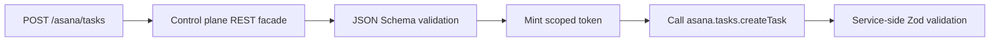

# OpenAPI And MCP

Goal: expose user-facing documentation and tools from the same ability metadata used by RPC.

Services do not generate full OpenAPI documents. Services define abilities and expose discovery. The control plane builds the OpenAPI document and MCP tool metadata from that ability metadata. Rendering a documentation UI is left to the consumer (see [Docs UI](#docs-ui)).

## Published Abilities

Only published abilities can become user-facing projections.

```ts
const asanaTasks = defineAbility({
  id: 'asana.tasks',
  exposure: 'published',
  access: 'plane',
  scopes: ['asana.tasks.write'],
  methods: {
    createTask: abilityMethod({
      input: CreateTaskInput,
      output: CreateTaskOutput,
      scopes: ['asana.tasks.write'],
      rest: { method: 'post', path: '/asana/tasks', summary: 'Create an Asana task' },
      mcp: { name: 'asana_create_task', description: 'Create a task in Asana' },
    }),
  },
  handler: ({ context, identity }) => new AsanaTasksHandler(context.env, identity),
});
```

Private abilities are still discovered by the control plane for routing and grants, but they never appear in OpenAPI or MCP listings.

Published projection is separate from `access`. `access: 'plane'` leaves upstream product auth to the control plane or gateway. `access: 'service'` keeps an ability available only to authenticated service callers.

## OpenAPI

The control plane serves the generated document:

```txt
GET /openapi.json
```

OpenAPI includes methods when both are true:

- the ability has `exposure: 'published'`
- the method has `rest` metadata

The request and response schemas come from the method's Zod input and output schemas through generated JSON Schema. The control plane only produces the document — it does not bundle a documentation UI.

Streaming methods (`stream: true`) cannot declare `rest` metadata — the generated OpenAPI documents request/response operations only.

## Docs UI

`service-plane` produces the OpenAPI document but does not render it. The control plane exposes its Hono app as `plane.app`, so you mount whichever OpenAPI viewer you prefer against `/openapi.json`. Two ready-made Hono extensions cover the common choices — neither is a dependency of `service-plane`, so install the one you want.

### Swagger UI

```sh
npm install @hono/swagger-ui
```

```ts
import { swaggerUI } from '@hono/swagger-ui';

// plane is your ServicePlaneControlPlane instance.
plane.app.get('/ui', swaggerUI({ url: '/openapi.json' }));
```

Reference: [Hono example — Swagger UI](https://hono.dev/examples/swagger-ui).

### Scalar

```sh
npm install @scalar/hono-api-reference
```

```ts
import { Scalar } from '@scalar/hono-api-reference';

plane.app.get('/scalar', Scalar({ url: '/openapi.json' }));
```

`Scalar` also accepts options such as `theme` and `pageTitle`, or a function `Scalar((c) => ({ url: '/openapi.json' }))` for per-request configuration. Reference: [Hono example — Scalar](https://hono.dev/examples/scalar).

Because the UI is not baked into the library, there is no bundled CDN dependency, and you are free to switch renderers, self-host assets, or apply your own CSP. If you pass a custom `app` to `ServicePlaneControlPlane`, mount these routes on that same app instead of `plane.app`.

## Edge Validation

The service remains the authoritative validator. Every RPC call still goes through Zod validation in the ability wrapper.

The control plane can also use the discovered JSON Schemas for HTTP edge validation on REST facades:



Edge validation is a user-facing guardrail. It should not replace service-side validation.

## MCP

The control plane exposes MCP tools, resources, and prompts from published methods carrying `mcp`, `mcpResource`, or `mcpPrompt` metadata. The developer decides per method which MCP surface (if any) it becomes — one method can back a tool, a resource, and a prompt at the same time.

```txt
POST /rpc/mcp
```

The endpoint implements the stateless portion of MCP Streamable HTTP (JSON-RPC 2.0), so stock MCP clients — Claude, Cursor, the MCP inspector — connect to it directly. Each POST carries one JSON-RPC message and the response is plain JSON, except calls to streaming tools, which answer over SSE (see [Tools](#tools)). No session id is issued, `GET` returns `405`, and notifications are acknowledged with `202`. Implemented methods: `initialize`, `ping`, `tools/list`, `tools/call`, `resources/list`, `resources/templates/list`, `resources/read`, `prompts/list`, and `prompts/get`. `initialize` declares the `tools`, `resources`, and `prompts` capabilities (no `listChanged`, no `subscribe` — the endpoint is stateless).

Every projected entry carries its Service Plane routing metadata (service, ability, method, scopes) under `_meta.servicePlane`, and every invocation — tool call, resource read, or prompt get — mints a scoped (or ingress-brokered) capability token and calls the backing ability through Service Plane.

### Tools

`mcp: { name, description? }` projects a method as a tool. The input schema comes from the method's Zod input schema. Object-shaped outputs also advertise `outputSchema` and return the validated object as `structuredContent`, with serialized JSON in a `text` block for compatibility. Primitive and array outputs omit `outputSchema` and return serialized text only. Handler failures are reported in-band with `isError: true`; unknown tools and authorization failures are JSON-RPC errors.

Streaming methods (`stream: true`) can project tools too. Because SSE is the only shape such a call can answer in, the request must accept it: an explicit `Accept` header that excludes `text/event-stream` (and `text/*`/`*/*`) gets `406` before any ability session is opened, while a missing `Accept` is treated as accepting anything. Unary tools, resources, and prompts stay usable for JSON-only clients. The plane opens the backing ability over a session transport (the endpoint's native ability RPC binding, then WebSocket) and answers `tools/call` over SSE per MCP streamable HTTP: while items arrive, it emits `notifications/progress` events (when the client sent `_meta.progressToken`), and the final response aggregates the items as `structuredContent: { items }` — MCP defines exactly one response per request, so the tool schema advertises the aggregated `{ items }` shape and `_meta.servicePlane.stream` marks the tool. Unbuffered transfer of very large streams belongs on a direct or brokered Cap'n Web session, not on MCP: the plane aggregates at most 10,000 items / 1 MiB of serialized items per streaming tool call (configurable via `mcp.streamLimits`) and fails the call in-band beyond that. `maxBytes` also gives optional progress notifications an independent cumulative byte budget; because every notification consumes that budget, it bounds how many can be emitted during a call. When that progress budget is exhausted, the plane stops sending notifications but continues building the separately bounded final result. Streaming methods cannot project resources or prompts (single-response surfaces); the service rejects such definitions at setup. See [Streaming](streaming.md).

This endpoint is request-scoped and non-resumable. If its SSE response delivery is abandoned, it
aborts the backing stream and disposes the request's ability session to bound serverless resource
lifetime. This is an intentional tradeoff from MCP's recommendation that disconnect alone should
not imply cancellation. `notifications/cancelled` is acknowledged but not correlated across
requests or isolates. Use a direct/brokered Cap'n Web session or a stateful MCP adapter for work
that must survive reconnects or requires protocol-level cancellation.

### Resources

`mcpResource: { uri, name, title?, description?, mimeType? }` projects a method as a resource. A literal URI lists under `resources/list`; a URI with `{variable}` template expressions lists under `resources/templates/list`, and on `resources/read` the matched variables (one path segment each, URI-decoded) become the method's input. Only simple `{name}` expressions are supported.

The read result is derived from the method output: a string is served as text (`mimeType` defaults to `text/plain`), an object with a string `blob` property passes through as binary (`mimeType` from the result, then the declaration, then `application/octet-stream`), and anything else is serialized as JSON text (`application/json`). Unknown URIs return the MCP resource-not-found error `-32002`.

```ts
readDocument: abilityMethod({
  input: z.object({ documentId: z.string() }),
  mcpResource: { name: 'document', uri: 'docs://documents/{documentId}', mimeType: 'text/markdown' },
  output: z.string(),
  scopes: ['docs.read'],
}),
```

### Prompts

`mcpPrompt: { name, title?, description?, arguments? }` projects a method as a prompt. When `arguments` is omitted, it is derived from the method input schema's top-level properties (respecting `required`). On `prompts/get` the client arguments become the method input; the method returns either `{ messages, description? }` (passed through) or a plain string (wrapped as a single user text message).

The MCP endpoint is enabled by default but **fail closed**: configure `mcp.caller` to authenticate the request and return the caller identity, or set `mcp: false` to disable it. Without a caller resolver the endpoint returns `500`; returning `undefined` refuses with `403`. For a retryable authentication failure, return a Hono `401` response carrying the appropriate `WWW-Authenticate` challenge. See the [broker caller](plane-creation.md#optional-broker) for the `caller` shape.

```ts
new ServicePlaneControlPlane({
  mcp: {
    // Incoming browser Origin headers must match the endpoint origin by default.
    // Add exact cross-origin clients only when the deployment intentionally needs them.
    allowedOrigins: ['https://app.example.com'],
    caller: (c) => {
      const token = c.req.header('authorization');
      if (token !== `Bearer ${c.env.MCP_GATEWAY_TOKEN}`) {
        return c.json({ error: 'Unauthorized' }, 401, {
          'WWW-Authenticate': 'Bearer realm="service-plane-mcp"',
        });
      }
      return { id: 'mcp-gateway', kind: 'user' };
    },
    serverInfo: { name: 'my-plane', version: '2026.7.0' }, // optional; defaults to the control-plane service id
  },
  // ...
});
```

The stateless endpoint implements the current `2025-11-25` revision and also accepts the compatible
`2025-06-18` and `2025-03-26` revisions. A missing `MCP-Protocol-Version` header is treated as
`2025-03-26`; an unsupported value returns HTTP `400`. Browser requests with an `Origin` header must
be same-origin unless listed in `mcp.allowedOrigins`; invalid or unlisted origins return `403`
before caller resolution and service discovery.

A stock client then connects with whatever credentials the `caller` resolver expects:

```json
{
  "mcpServers": {
    "service-plane": {
      "type": "http",
      "url": "https://plane.example.com/rpc/mcp",
      "headers": { "Authorization": "Bearer <token>" }
    }
  }
}
```

## Caching

Cache service discovery and generated OpenAPI separately.

```txt
discovery:asana -> service discovery document
openapi:bundle -> generated OpenAPI document
```

Discovery cache keeps service metadata fresh without refetching every service on every request. OpenAPI cache avoids rebuilding the merged document for each docs request.

Next: [create a control plane](plane-creation.md), [reference](reference.md), and [architecture](architecture.md).
