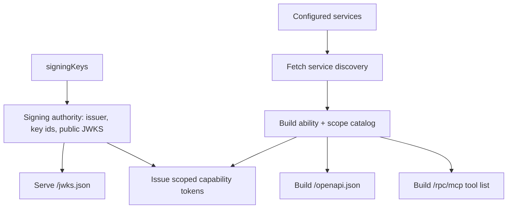

# Create A Control Plane

Goal: create the service that issues tokens, discovers services, and builds user-facing projections.

The smallest useful control plane knows which services exist, which callers may use which scopes, and how to sign capability tokens.

## Minimal Plane

```ts
import {
  ServicePlaneControlPlane,
  cloudflareServiceBinding,
  hmacServiceClientAuth,
} from 'service-plane/control-plane';

export default new ServicePlaneControlPlane({
  signingKeys: (env) => [{ kid: '2026-07', secret: env.STS_SIGNING_SECRET }],
  authenticateCaller: (c) =>
    hmacServiceClientAuth({
      clients: [{ clientId: 'workflow-runner', secret: c.env.WORKFLOW_RUNNER_SECRET }],
    })(c),
  services: (c) => [
    cloudflareServiceBinding({
      id: 'asana',
      binding: c.env.ASANA,
      grants: [{ caller: 'workflow-runner', scopes: ['asana.tasks.write'] }],
    }),
  ],
});
```

This mounts:

```txt
POST /.well-known/service-plane/capability-token
GET  /.well-known/service-plane/jwks.json
GET  /openapi.json
POST /rpc/mcp                                    (MCP streamable HTTP)
```

To serve a documentation UI, mount a Hono renderer on `plane.app` against `/openapi.json` — see [OpenAPI and MCP: Docs UI](openapi-mcp.md#docs-ui).

## What The Plane Does



The plane does not implement Asana, ClickUp, or Moco logic. It only knows how to discover those services, validate grants, issue tokens, and project published metadata.

JWKS hangs off the signing authority alone: it needs no discovery, so services can keep refreshing
their verification keys while a target service is down. Everything on the catalog path fails closed
when discovery cannot be completed. See [auth.md](auth.md#signing-authority-and-authorization-catalog).

Every inbound request gets an `X-Request-Id` (adopted from the caller or generated), and the broker and MCP surfaces forward it to services on every brokered call. Broker connects, MCP tool calls, and configuration errors are logged as structured JSON events; pass `log` to redirect them to your own sink or `log: false` to silence them. See the logging section in [the reference](reference.md).

## Service-Plane Ingress

For production services, configure `ServicePlaneService` with `ingress: {}` and send callers through the control-plane broker.

```ts
cloudflareServiceBinding({
  id: 'asana',
  binding: c.env.ASANA,
  grants: [{ caller: 'workflow-runner', scopes: ['asana.tasks.write'] }],
});
```

The broker uses the existing capability issuer to mint a signed brokered token. A caller that sends a valid non-brokered capability token directly to `/rpc/<abilityId>` gets `403` before any ability handler is created.

## Grants

Grants decide which caller can request which scopes for a service.

```ts
cloudflareServiceBinding({
  id: 'asana',
  binding: c.env.ASANA,
  grants: [
    { caller: 'workflow-runner', scopes: ['asana.tasks.write'] },
    { caller: 'admin-worker', scopes: ['asana.tasks.write'] },
  ],
});
```

If a caller asks for an unknown service, unknown scope, or ungranted scope, the token endpoint rejects the request.

Grants are checked per target service. If one service's grant goes stale — it names a scope that service renamed or removed on its next deploy, or that service is currently undiscoverable — only tokens for that target are refused. Other services keep issuing, brokering, and serving MCP normally. See [auth.md](auth.md#signing-authority-and-authorization-catalog).

## Discovery Cache

Resolving the catalog is a fan-out: the plane fetches `/.well-known/service-plane/service.json` from **every** configured service. It needs the catalog to issue a token — that is how it knows which scopes a service actually has — so without a cache a plane with 50 services makes 50 requests to mint one token.

**This is cached by default.** A plane you configure with nothing extra keeps a process-local snapshot for 30 seconds, which is per isolate on Cloudflare and per process on Node. Nothing to install and no infrastructure required.

Pass `discoveryCache` to replace it with a shared store — KV, Redis — so a whole fleet resolves the catalog once instead of once per replica:

```ts
const plane = new ServicePlaneControlPlane({
  discoveryCache: env.SERVICE_DISCOVERY_CACHE,
  // ...
});
```

Or turn it off with `discoveryCache: false` when the plane must see every catalog change immediately and would rather pay the fan-out.

There are two ways the catalog gets used, and you can give each its own store:

```ts
const plane = new ServicePlaneControlPlane({
  discoveryCache: {
    token: redisRegistryCache(),        // issuing tokens, brokering, MCP
    openapi: env.SERVICE_DISCOVERY_KV,  // building the OpenAPI document
  },
  // ...
});
```

`token` covers the whole call path. Brokering and MCP are not separate: a brokered call *is* a token issuance plus a registry lookup, and both halves have to come from one snapshot. `openapi` is the projection path — cold, infrequent, and happy on a store whose reads are slow.

`default` covers whichever of the two you do not name, and either can be set to `false` on its own. Splitting is worth it when the two genuinely differ in what they need, but note the cost: **separate stores warm separately**, so the same catalog is fetched and held once per store. One shared cache is the cheaper default for a reason.

On Cloudflare, see [layering a shared store behind the in-memory one](cloudflare.md#sharing-the-discovery-cache-across-isolates) before reaching for KV or a Durable Object.

The registry derives distinct cache keys from the configured service ids and origins, so one instance is safe to share across routes and replicas. This is separate from `openapi.cache`, which caches the generated document rather than the catalog behind it.

A discovery that could not reach every service is never cached — an unreachable service is simply absent from the snapshot, and storing that would keep the plane refusing it for the rest of the TTL after it recovers.

Measured with `npm run bench` at one millisecond per service — roughly a Cloudflare service binding, and low for anything over the public internet:

| Catalog | no cache | warm cache |
| --- | --- | --- |
| 20 services | 1.7 ms | 0.006 ms |
| 200 services | 22.7 ms | 0.065 ms |

ETag revalidation helps less than it looks: a 304 skips parsing and validating the document, but it is still one round trip per service. At 20 services over a 10 ms link it saves under a millisecond.

Staleness here is mostly a convergence question. A token minted from a stale catalog is still checked by the service against its current definition, so a scope the service no longer declares is refused at the service regardless of what the plane cached. Grants are plane-side configuration and are re-read on every request, so revoking one takes effect immediately.

**One catalog change is not covered by that.** `access` is enforced by the broker, from the catalog, and the service does not re-check it. Tightening an ability from `access: 'plane'` to `access: 'service'` therefore takes effect only once the cache refreshes: until then a non-service caller that already holds a grant for the scope can still reach it. Revoke the grant for immediate effect, or set `discoveryCache: false` on a plane where `access` changes must land at once. Tracked in [#32](https://github.com/JUVOJustin/service-plane/issues/32).

## OpenAPI Cache

The control plane can cache the bundled OpenAPI document.

```ts
const plane = new ServicePlaneControlPlane({
  openapi: {
    cache: env.OPENAPI_CACHE,
    cacheTtlSeconds: 300,
  },
  // ...
});
```

The document is derived from published ability metadata. Individual services do not serve OpenAPI files.

## Signing Material

The plane memoizes one thing, and it needs no configuration: the signing material derived from your secret. Deriving a private JWK is a P-256 scalar multiplication and proving the key pair is a sign/verify round-trip — together about 9.5 ms — and neither depends on your service catalog or grants, so the result is reused until the key set changes.

The capability issuer itself is rebuilt on every request. Assembling one around already-derived material costs 0.03 ms at 20 services and 0.35 ms at 200, which is not worth a cache with a bound, an eviction policy and an expiry to get right. Two consequences worth knowing:

- **A changed grant takes effect immediately.** Grants are plane-side configuration and are re-read on every request, so withdrawing one refuses the next request — there is no issuer cache holding the old answer. A changed *catalog* is different: it converges within the [discovery cache](#discovery-cache) TTL, because that is where the service's own view of itself is held.
- **Cost scales with catalog size**, not with how many distinct configurations you resolve. A plane that hands different callers different grants pays nothing extra.

The memo is per instance, in memory. On Cloudflare that means per isolate: a plane constructed at module scope (as above) keeps it for the isolate's lifetime and across the many requests it serves, but nothing is shared between isolates and each warms up independently. Constructing the plane *inside* the fetch handler would instead re-derive the signing material on every request — that is the one arrangement worth avoiding.

`npm run bench` tracks the ratio these numbers rest on.

## Optional Broker

The broker lets a caller discover and connect to abilities through the plane. The broker and MCP endpoints are **fail closed**: you must supply a `caller` resolver that authenticates the request and returns the caller identity. A request with no configured resolver returns `500`; returning `undefined` refuses the request with `403`. For retryable authentication failures, return a Hono `401` response with the authentication scheme's `WWW-Authenticate` challenge. Nothing is brokered without an authenticated caller.

```ts
new ServicePlaneControlPlane({
  broker: {
    path: '/rpc/broker',
    // Use your deployment's verifier here. The resolver owns the exact challenge.
    caller: async (c) => {
      const serviceId = await authenticateBrokerRequest(c);
      if (!serviceId) {
        return c.json({ error: 'Unauthorized' }, 401, {
          'WWW-Authenticate': 'Bearer realm="service-plane"',
        });
      }
      return { id: serviceId, kind: 'service' };
    },
  },
  // ...
});
```

Both mounts also accept `connInfo`, an opt-in resolver that forwards the original client's connection to the target service (`connInfo: (c) => getConnInfo(c)`, importing `getConnInfo` from your runtime's Hono adapter). It reaches handlers only on brokered calls into ingress-protected services and is advisory — see [Forwarded Connection Info](auth.md#forwarded-connection-info).

`caller` returns a `BrokerCaller` — `{ id, kind: 'service' | 'user' }` — or an application-owned `Response`. Existing Hono authentication middleware is the preferred place to generate a challenge when it already owns that policy. Service callers (`kind: 'service'`) can reach `access: 'service'` abilities and are brokered under their own service id; other callers are brokered under the control-plane identity for `access: 'plane'` abilities. To intentionally allow anonymous access, return a fixed caller from the resolver — it is always an explicit choice, never a default.

The broker connects by ability:

```ts
broker.ability('asana', 'asana.tasks').connect(['asana.tasks.write']);
```

When service-plane ingress protection is enabled, callers must use the broker or another approved service-plane component that can mint brokered capability tokens.

Streaming ability methods proxy through the broker as native Cap'n Web `ReadableStream`s: connect to the broker over WebSocket (`upgradeWebSocket`), and the plane reaches the service over its own session transport — the endpoint's native ability RPC binding when available (pass it as `cloudflareServiceBinding({ abilityRpc })`), otherwise WebSocket. See [Streaming](streaming.md).

Next: [auth](auth.md), [OpenAPI and MCP](openapi-mcp.md), and [Cloudflare](cloudflare.md).
