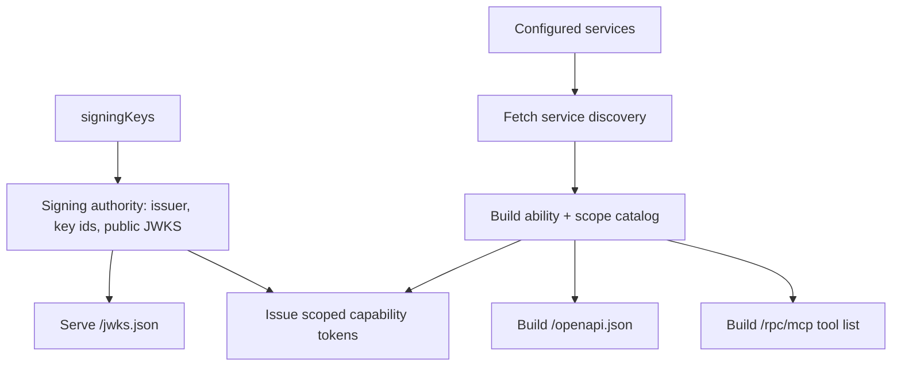

# Create A Control Plane

Goal: create the service that issues tokens, discovers services, and builds user-facing projections.

The smallest useful control plane knows which services exist, which callers may use which scopes, and how to sign capability tokens.

## Minimal Plane

```ts
import {
  ServicePlaneControlPlane,
  cloudflareServiceBinding,
  hmacServiceClientAuth,
} from 'service-plane/control-plane';

export default new ServicePlaneControlPlane({
  signingKeys: (env) => [{ kid: '2026-07', secret: env.STS_SIGNING_SECRET }],
  authenticateCaller: (c) =>
    hmacServiceClientAuth({
      clients: [{ clientId: 'workflow-runner', secret: c.env.WORKFLOW_RUNNER_SECRET }],
    })(c),
  services: (c) => [
    cloudflareServiceBinding({
      id: 'asana',
      binding: c.env.ASANA,
      grants: [{ caller: 'workflow-runner', scopes: ['asana.tasks.write'] }],
    }),
  ],
});
```

This mounts:

```txt
POST /.well-known/service-plane/capability-token
GET  /.well-known/service-plane/jwks.json
GET  /openapi.json
POST /rpc/mcp                                    (MCP streamable HTTP)
```

To serve a documentation UI, mount a Hono renderer on `plane.app` against `/openapi.json` — see [OpenAPI and MCP: Docs UI](openapi-mcp.md#docs-ui).

## What The Plane Does



The plane does not implement Asana, ClickUp, or Moco logic. It only knows how to discover those services, validate grants, issue tokens, and project published metadata.

JWKS hangs off the signing authority alone: it needs no discovery, so services can keep refreshing
their verification keys while a target service is down. Everything on the catalog path fails closed
when discovery cannot be completed. See [auth.md](auth.md#signing-authority-and-authorization-catalog).

Every inbound request gets an `X-Request-Id` (adopted from the caller or generated), and the broker and MCP surfaces forward it to services on every brokered call. Broker connects, MCP tool calls, and configuration errors are logged as structured JSON events; pass `log` to redirect them to your own sink or `log: false` to silence them. See the logging section in [the reference](reference.md).

## Service-Plane Ingress

For production services, configure `ServicePlaneService` with `ingress: {}` and send callers through the control-plane broker.

```ts
cloudflareServiceBinding({
  id: 'asana',
  binding: c.env.ASANA,
  grants: [{ caller: 'workflow-runner', scopes: ['asana.tasks.write'] }],
});
```

The broker uses the existing capability issuer to mint a signed brokered token. A caller that sends a valid non-brokered capability token directly to `/rpc/<abilityId>` gets `403` before any ability handler is created.

## Grants

Grants decide which caller can request which scopes for a service.

```ts
cloudflareServiceBinding({
  id: 'asana',
  binding: c.env.ASANA,
  grants: [
    { caller: 'workflow-runner', scopes: ['asana.tasks.write'] },
    { caller: 'admin-worker', scopes: ['asana.tasks.write'] },
  ],
});
```

If a caller asks for an unknown service, unknown scope, or ungranted scope, the token endpoint rejects the request.

Grants are checked per target service. If one service's grant goes stale — it names a scope that service renamed or removed on its next deploy, or that service is currently undiscoverable — only tokens for that target are refused. Other services keep issuing, brokering, and serving MCP normally. See [auth.md](auth.md#signing-authority-and-authorization-catalog).

## Discovery Cache

The broker and MCP surfaces can each cache service discovery documents. Pass the same cache to both when they share the same service catalog; the registry creates distinct cache keys from the configured service ids and origins.

```ts
const plane = new ServicePlaneControlPlane({
  broker: {
    cache: env.SERVICE_DISCOVERY_CACHE,
    caller: resolveCaller,
  },
  mcp: {
    cache: env.SERVICE_DISCOVERY_CACHE,
    caller: resolveCaller,
  },
  // ...
});
```

Use discovery caching to avoid repeatedly fetching `/.well-known/service-plane/service.json` from every service. Cache discovery separately from generated OpenAPI; broker and MCP discovery entries use the built-in registry TTL.

## OpenAPI Cache

The control plane can cache the bundled OpenAPI document.

```ts
const plane = new ServicePlaneControlPlane({
  openapi: {
    cache: env.OPENAPI_CACHE,
    cacheTtlSeconds: 300,
  },
  // ...
});
```

The document is derived from published ability metadata. Individual services do not serve OpenAPI files.

## Optional Broker

The broker lets a caller discover and connect to abilities through the plane. The broker and MCP endpoints are **fail closed**: you must supply a `caller` resolver that authenticates the request and returns the caller identity. A request with no configured resolver returns `500`; returning `undefined` refuses the request with `403`. For retryable authentication failures, return a Hono `401` response with the authentication scheme's `WWW-Authenticate` challenge. Nothing is brokered without an authenticated caller.

```ts
new ServicePlaneControlPlane({
  broker: {
    path: '/rpc/broker',
    // Use your deployment's verifier here. The resolver owns the exact challenge.
    caller: async (c) => {
      const serviceId = await authenticateBrokerRequest(c);
      if (!serviceId) {
        return c.json({ error: 'Unauthorized' }, 401, {
          'WWW-Authenticate': 'Bearer realm="service-plane"',
        });
      }
      return { id: serviceId, kind: 'service' };
    },
  },
  // ...
});
```

Both mounts also accept `connInfo`, an opt-in resolver that forwards the original client's connection to the target service (`connInfo: (c) => getConnInfo(c)`, importing `getConnInfo` from your runtime's Hono adapter). It reaches handlers only on brokered calls into ingress-protected services and is advisory — see [Forwarded Connection Info](auth.md#forwarded-connection-info).

`caller` returns a `BrokerCaller` — `{ id, kind: 'service' | 'user' }` — or an application-owned `Response`. Existing Hono authentication middleware is the preferred place to generate a challenge when it already owns that policy. Service callers (`kind: 'service'`) can reach `access: 'service'` abilities and are brokered under their own service id; other callers are brokered under the control-plane identity for `access: 'plane'` abilities. To intentionally allow anonymous access, return a fixed caller from the resolver — it is always an explicit choice, never a default.

The broker connects by ability:

```ts
broker.ability('asana', 'asana.tasks').connect(['asana.tasks.write']);
```

When service-plane ingress protection is enabled, callers must use the broker or another approved service-plane component that can mint brokered capability tokens.

Streaming ability methods proxy through the broker as native Cap'n Web `ReadableStream`s: connect to the broker over WebSocket (`upgradeWebSocket`), and the plane reaches the service over its own session transport — the endpoint's native ability RPC binding when available (pass it as `cloudflareServiceBinding({ abilityRpc })`), otherwise WebSocket. See [Streaming](streaming.md).

Next: [auth](auth.md), [OpenAPI and MCP](openapi-mcp.md), and [Cloudflare](cloudflare.md).
