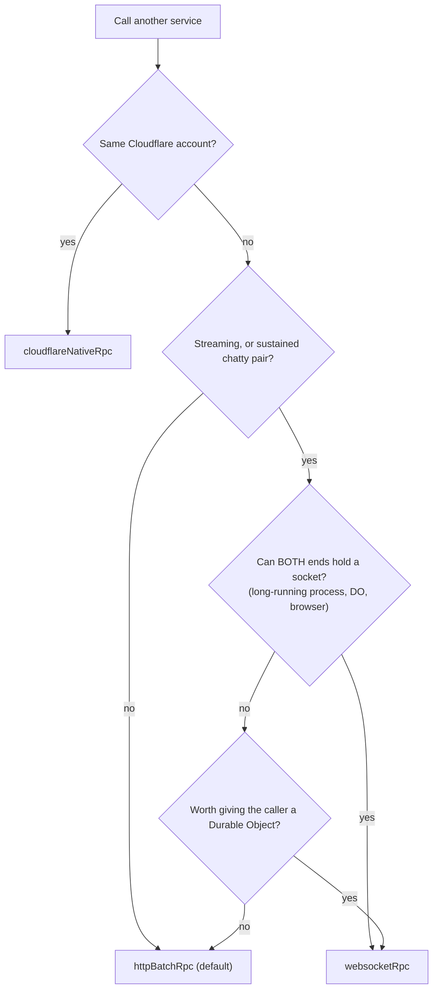

# Choosing A Transport

Goal: decide which transport to use between two services — by environment, call shape, performance, and cost.

Service Plane offers four transports. They are interchangeable at the ability level (same tokens, same validation, same handlers), so this is purely a routing decision — and it can differ per caller/service pair.

| Transport | Shape | Streams | Where |
| --- | --- | --- | --- |
| `cloudflareNativeRpc(binding)` | session (Workers RPC) | yes | Cloudflare, same account |
| `cloudflareServiceBindingRpc(binding)` / `httpBatchRpc(url)` | one HTTP request per call (with pipelining) | no | everywhere |
| `websocketRpc(url, { createWebSocket? })` | long-lived session | yes | everywhere both ends can hold a socket |
| `customRpcTransport(transport)` | whatever you bring | yes | tests, message ports, exotic links |

## Decision Rules

Apply in order; the first match wins.

1. **Same Cloudflare account → native binding RPC. Always.** No public egress, streams work natively, and billing is favorable: requests through service bindings [do not incur additional request fees](https://developers.cloudflare.com/workers/platform/pricing/) — CPU time is billed once across the chain. This holds for streaming too.
2. **Request/response between services → HTTP-batch. The default.** Stateless, retryable, observable, no connection lifecycle to manage, and promise pipelining resolves chained calls in one round trip. The price: the capability token is verified on every call (~100 µs of ES256; on Node currently plus a ~1 ms scheduling floor tracked in [#12](https://github.com/JUVOJustin/service-plane/issues/12)).
3. **Chatty pair or streaming → WebSocket, but only if *both* ends can hold the socket.** A session authenticates once, then calls cost ~10 µs; streams require a session transport anyway. Which brings us to the question that decides most real cases:

### Can this end hold a socket?

| End of the connection | Can hold a long-lived WebSocket? |
| --- | --- |
| Long-running Node / Bun / Deno process | **Yes — and it is essentially free** (one TCP socket and some memory; no per-message platform cost) |
| Stateless Cloudflare Worker as the **caller** | **No.** A Worker can open outbound WebSockets, but [cannot persist a connection across invocations](https://developers.cloudflare.com/workers/runtime-apis/websockets/) — each request would pay a fresh upgrade handshake, which is strictly worse than one HTTP-batch POST |
| Durable Object | **Yes, but it bills duration for the whole connection.** Normally the [WebSocket Hibernation API](https://developers.cloudflare.com/durable-objects/best-practices/websockets/) would make accepted sockets cheap — but **Cap'n Web sessions cannot hibernate yet** ([capnweb#36](https://github.com/cloudflare/capnweb/issues/36), open feature request): the session's in-memory state must survive between messages, so a DO holding a Cap'n Web session — inbound or outbound — [bills wall-clock duration for the entire connection](https://developers.cloudflare.com/durable-objects/platform/pricing/) |
| Browser / external client | Yes |

If either end answers "no", use HTTP-batch (or restructure so a Durable Object owns the session).

## Scenarios

| Situation | Use | Why |
| --- | --- | --- |
| CF worker → CF worker, same account — any shape, including streaming | `cloudflareNativeRpc` | Rule 1: free through bindings, streams natively, no public surface |
| CF worker → CF worker, **different account**, request/response | `httpBatchRpc` over the public URL | No bindings across accounts; neither stateless worker can hold a socket, so per-request WebSocket = handshake + teardown every call. Both accounts bill their own requests either way |
| CF worker → CF worker, different account, **streaming** | WebSocket, with a **Durable Object as the caller** holding the session | Someone must own the socket; only a DO can — and it bills duration for the whole connection (no hibernation for Cap'n Web sessions, [capnweb#36](https://github.com/cloudflare/capnweb/issues/36)). If the traffic doesn't justify that, reconsider: same-account placement (rule 1), or request/response with batched results |
| Node service ↔ Node service, both long-running, frequent calls or streaming | `websocketRpc` | Sockets are free on Node; auth amortizes to once per session (~10 µs/call vs ~1.9 ms/call batch on Node today) |
| Node ↔ Node, occasional calls (webhooks, cron fan-out) | `httpBatchRpc` | Reconnect/heartbeat upkeep isn't worth it below a few calls per second |
| Many stateless CF workers → one Node service | `httpBatchRpc` | The callers can't hold sockets, so a WebSocket server on the Node side gains nothing |
| Browser or AI session → control plane broker (interactive, streaming tools) | WebSocket to `/rpc/broker` | Long-lived by nature. On Cloudflare, serving the socket from a plain Worker costs no duration (only CPU per message); a Durable Object adds cross-connection coordination but bills duration for the whole connection — Cap'n Web can't hibernate ([capnweb#36](https://github.com/cloudflare/capnweb/issues/36)) — so keep sessions purposeful and close them when idle. Stock AI clients use the MCP endpoint instead |
| LLM token streaming | any session transport + the [batching recipe](streaming.md#high-frequency-streams) | Streams need sessions; message count dominates cost |

## Cloudflare Cost Notes

Doc-backed facts that drive the rules above (see [Workers pricing](https://developers.cloudflare.com/workers/platform/pricing/) and [Durable Objects pricing](https://developers.cloudflare.com/durable-objects/platform/pricing/) for current numbers):

- **Service bindings**: no additional request fees; CPU time across the chain is billed once. This is why rule 1 has no exceptions.
- **Stateless Workers**: no duration billing at all. A WebSocket upgrade counts as one request; incoming WebSocket messages are billed at a favorable 20:1 ratio; outgoing messages are free. So *serving* WebSockets on a plain Worker is cheap — the constraint is never cost, it's that a stateless *caller* can't keep the socket.
- **Durable Objects**: `accept()`ing a WebSocket bills duration for the entire connection unless the Hibernation API lets the object sleep between messages — **and Cap'n Web sessions cannot hibernate today** ([capnweb#36](https://github.com/cloudflare/capnweb/issues/36) is an open feature request): the RPC session keeps in-memory state between messages. Until that lands, treat any DO-held Service Plane session as duration-billed for its whole lifetime, inbound or outbound. Mitigations: idle timeouts that close sessions, plain-Worker WS serving where no cross-connection state is needed, or HTTP-batch.
- **Node (self-hosted)**: no platform billing dimension; a WebSocket costs a file descriptor, some memory, and your reconnect/heartbeat logic.

## Performance

From `npm run bench` (in-memory, network excluded — see [Streaming](streaming.md#high-frequency-streams) for the streaming numbers):

- Persistent session: **~10 µs per call** after the one-time authenticate; within ~25% of a raw Cap'n Web session.
- HTTP-batch: **per-call token verify (~100 µs)** plus batch framing; on Node currently a ~1 ms scheduling floor on top ([#12](https://github.com/JUVOJustin/service-plane/issues/12)) — one more reason chatty Node pairs should hold a session.
- Native binding: no serialization at all in-process; on Cloudflare it is also the only transport with zero public egress.
- A reused brokered session (plane in the data path) benchmarks ~2× *faster* than a hand-rolled two-hop Hono chain with bearer middleware — connection reuse pays for the real crypto.

## Rule Of Thumb

Next: [Streaming](streaming.md), [Cloudflare](cloudflare.md), [Node.js](nodejs.md), and the [reference](reference.md).
