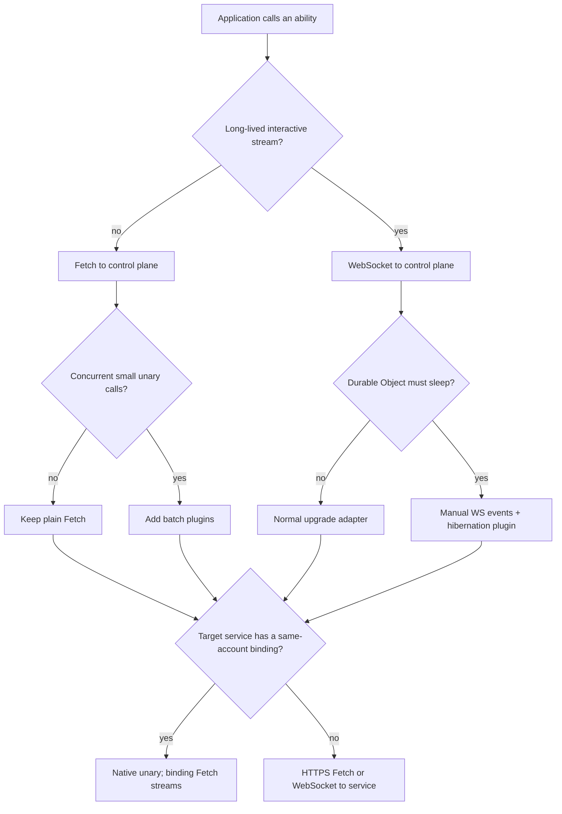

# Choosing A Transport

Goal: choose the caller-to-plane and plane-to-service transports independently.

The production topology has two hops:

```text
application -> control plane -> private service
```

Both hops use oRPC, but they solve different problems. The public hop authenticates an application
caller and exposes one stable API. The private hop carries a short-lived brokered capability token to
the service that owns the ability. Keeping the control plane in the path is what enforces discovery,
grants, delegation, ingress, and central MCP/OpenAPI exposure.

## Transport Matrix

| Transport | Use | Unary | Streams | Connection state |
| --- | --- | --- | --- | --- |
| Fetch | default public and private RPC | yes | yes | none |
| Fetch + batch plugins | concurrent small calls | yes | not for hibernation streams | none |
| WebSocket | interactive or high-frequency sessions | yes | yes | caller owns reconnect |
| Cloudflare native service binding | plane-to-service in one account | yes, without HTTP serialization | uses the binding's Fetch fallback | none for unary |
| Custom oRPC link | tests or a runtime-specific channel | link-dependent | link-dependent | link-dependent |

`createBrokeredAbilityClient()` configures the application-to-plane hop. The control plane chooses the
private hop from service discovery and the endpoint registered with `cloudflareServiceBinding()` or
`httpsService()`.

## Recommended Defaults

1. Use Fetch from browsers, headless fronts, cron jobs, and ordinary services to the control plane.
2. Register a Cloudflare service binding with `abilityRpc.invokeAbility` for services in the same
   account. The broker uses native RPC for unary procedures and binding Fetch for streams.
3. Use WebSocket when the application needs a long-lived interactive stream or enough repeated calls
   to justify connection ownership.
4. Add batching for bursts of independent unary calls. Add compression for large payloads after
   measuring CPU and transfer size.

This means a deployment with one public control-plane Worker still gets native Worker-to-Worker RPC.
The browser or headless front calls only the control plane; the control plane then calls an auxiliary
service Worker through its private binding. The service Worker does not need public ingress.

## Cloudflare Service Bindings

Expose `ServicePlaneService.invokeAbility` from the service's Worker entrypoint and register it
explicitly on the control plane:

```ts
cloudflareServiceBinding({
  id: 'tasks',
  binding: c.env.TASKS,
  abilityRpc: {
    invokeAbility: (input) => c.env.TASKS.invokeAbility(input),
  },
  grants: [{ caller: 'headless-front', scopes: ['tasks.read'] }],
})
```

The explicit `abilityRpc` option matters. A Cloudflare binding proxy makes every property appear
callable, so runtime feature probing cannot reliably distinguish a Worker that really exports
`invokeAbility`.

Native RPC is intentionally unary. A live async iterator needs oRPC's streaming codec and backpressure,
so the client and broker route that procedure through `binding.fetch`. This is still private
Worker-to-Worker traffic through the service binding.

## WebSocket

For a public interactive client:

```ts
const tasks = createBrokeredAbilityClient({
  ability: tasksAbility,
  scopes: ['tasks.read'],
  targetServiceId: 'tasks',
  transport: {
    type: 'websocket',
    url: 'wss://api.example.com/rpc/broker/ws',
    reconnect: { enabled: true },
  },
});
```

Configure `broker.upgradeWebSocket` on `ServicePlaneControlPlane`. For a direct service WebSocket,
declare `websocket` on the ability and configure `rpc.upgradeWebSocket` on `ServicePlaneService`.
Authentication headers are sent per logical oRPC call, so a refreshed capability token does not
require rebuilding the procedure client.

A WebSocket is bound to the process or isolate serving it. Reconnect can restore the transport, but
it cannot make an in-flight non-idempotent mutation safe to replay. Retry only methods declared
idempotent or protected by an idempotency key.

## Durable Object Hibernation

oRPC hibernation is endpoint-local: the Durable Object must own the client-facing WebSocket. A
normal control-plane broker can proxy a live iterator, but cannot hibernate its public socket by
borrowing a private service's subscription id. In a strict one-public-control-plane deployment, use
ordinary brokered Fetch/WebSocket streams unless the application adds a deliberate control-plane
handoff to a Durable Object. Service Plane does not currently ship that handoff protocol.

Hibernation requires three pieces:

- `new HibernationHandlerPlugin()` in `rpc.plugins`
- procedures declared with `ability.hibernationStream()` that return `HibernationAsyncIteratorClass`
- a Durable Object that accepts the socket with `acceptWebSocket` and forwards platform events to
  `service.webSocketMessage()` and `service.webSocketClose()`

Set `rpc.manualWebSocket: true` when the Durable Object owns acceptance instead of a Hono upgrade
helper. The plugin serializes the iterator subscription id into the socket attachment; application
code sends later events with `encodeAbilityHibernationEvent(outputSchema, id, value)`. That helper
validates each awakened yield against the procedure's output schema before encoding it.

Do not batch a procedure returning `HibernationAsyncIteratorClass`. The batch response owns a finite
request lifecycle and cannot preserve the hibernating iterator subscription. Exclude those procedures
in the batch link's filter or group condition.

## Batching And Compression

Enable a feature on both ends of the same hop:

```ts
const service = new ServicePlaneService({
  // ...
  rpc: {
    plugins: [
      new BatchHandlerPlugin(),
      new RequestCompressionHandlerPlugin(),
      new ResponseCompressionHandlerPlugin(),
    ],
  },
});

const client = createAbilityClient({
  // ...
  transport: {
    type: 'fetch',
    plugins: [
      new BatchLinkPlugin({ groups: [{ condition: true, context: {} }] }),
      new RequestCompressionLinkPlugin(),
      new ResponseCompressionLinkPlugin(),
    ],
  },
});
```

Compression should run after batching so it sees the final combined request or response. Batching
reduces request count but also couples latency: the group completes at the speed of its slowest
subrequest. Keep unrelated latency classes in separate groups.

The same plugin option exists on the control-plane broker. A batch plugin on the application client
and broker handler combines several application-to-plane calls; it does not turn the subsequent calls
to different services into one network request.

## TanStack Query Does Not Change Routing

`createBrokeredAbilityClient()` returns a normal oRPC router client, so
`createTanstackQueryUtils(client)` can create query and mutation options. TanStack Query still calls
the one public control plane. The plane still discovers the target, checks grants, mints a brokered
token, and calls the service. Client caching and request deduplication do not bypass Service Plane.

## Rule Of Thumb



Next: [Streaming](streaming.md), [Cloudflare](cloudflare.md), [Node.js](nodejs.md), and the [reference](reference.md).
