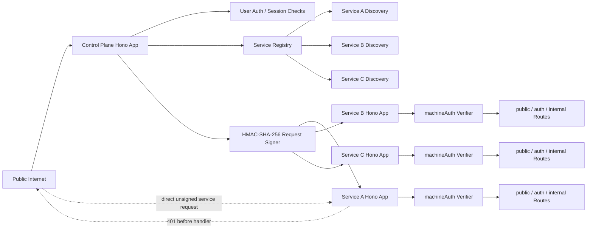

# Architecture

`service-plane` models a system with a public control plane and independently owned service routers.

The control plane owns public ingress, global authentication, docs, and routing decisions. Each service owns its Hono routes, internal APIs, workflows, storage, and provider-specific validation.

## Runtime Shape



The word `public` is a control-plane exposure level, not an instruction to expose a service Worker or service process directly to the world. A direct request to a service route should still pass `machineAuth`. Discovery can remain reachable so the control plane can learn which routes a service provides.

## Primitives

**Service**

A service is a runtime unit with an id, title, version, and one or more route namespaces.

**Namespace**

A namespace binds one Hono app to a visibility level and path prefix.

```ts
defineNamespace({
  app: routes,
  prefix: '/providers/example',
  visibility: 'internal',
});
```

**Discovery document**

Every service can expose `/.well-known/service-plane/service.json`. The document is generated from its namespaces and Hono route table, so route implementation and discovery stay close together.

**Control-plane registry**

The registry fetches discovery documents from configured service endpoints. Endpoints may be Cloudflare Service Bindings or normal HTTPS services.

**Control-plane proxy**

The proxy routes matching requests to services. It never proxies `internal` routes publicly.

**Machine auth**

Service calls use HMAC-SHA-256 signed requests. This is portable across Cloudflare Workers and Node.js because it only depends on Fetch and Web Crypto.

## What This Package Does Not Own

`service-plane` does not own connection storage, workflow engines, tenant databases, or provider SDKs. Those stay service-local. A future optional connections layer can be added if the pattern proves reusable across services.
