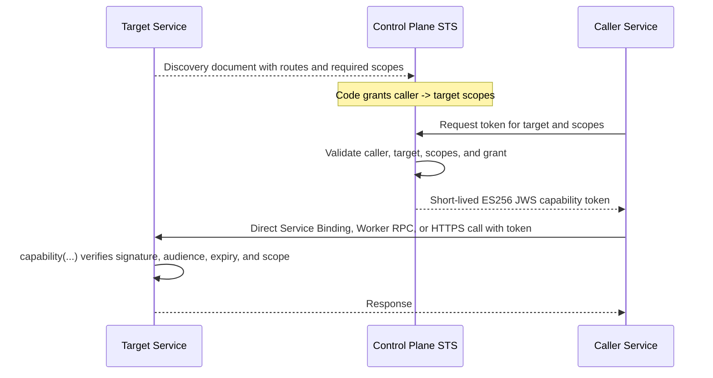

# Architecture

`service-plane` models a system with a public control plane and independently owned service routers.

The control plane owns public ingress, global authentication, docs, service grants, and STS token issuance. Each service owns its Hono routes, internal APIs, workflows, storage, provider-specific validation, and capability scope catalog.

## Runtime Shape



The control plane is on the token issuance path, not the request data path. Cloudflare-internal services can call each other directly through Service Bindings or Worker RPC. External Hono services use HTTPS with the same token verifier.

Token verification is local and cache-free. A service only needs the control plane public JWKS to verify a received token. Caller-side token caching only reduces repeated token issuance calls to the control plane. The default cache is in-memory, and high-throughput Cloudflare Workers can provide a Cache API or KV adapter without adding a separate cache service.

## Primitives

**Service**

A service is a runtime unit with an id, title, version, and one or more route namespaces.

**Namespace**

A namespace binds one Hono app to a visibility level and path prefix.

```ts
defineNamespace({
  app: routes,
  prefix: '/providers/example',
  visibility: 'internal',
});
```

**Discovery document**

Every service can expose `/.well-known/service-plane/service.json`. The document is generated from its namespaces, Hono route table, route capability annotations, and optional capability catalog.

**Capability catalog**

A service defines operation-level scopes such as `fizzy.users.lookup`. Scopes are owned by the target service, not by the caller.

**Capability route annotation**

`capability('fizzy.users.lookup')` is both the route annotation and the runtime guard. It adds required scope metadata to discovery and verifies incoming STS tokens when the route runs.

**Control-plane STS**

The control plane issues short-lived ES256 JWS capability tokens. Grants are code-first: caller, target, and allowed scopes are explicitly listed.

The STS private key is not shared with services. Services verify tokens with the public JWKS, so a caller cannot mint or alter its own token.

**Control-plane registry**

The registry fetches discovery documents from configured service endpoints. Endpoints may be Cloudflare Service Bindings or normal HTTPS services.

**Control-plane proxy**

The proxy routes matching requests to services. It never proxies `internal` routes publicly.

**Control-plane proxy tokens**

When the control plane proxies a route with `requiredScopes`, it attaches an STS token for the target service. The service verifies the token the same way it verifies direct service-to-service calls.

## What This Package Does Not Own

`service-plane` does not own connection storage, workflow engines, tenant databases, or provider SDKs. Those stay service-local. A future optional connections layer can be added if the pattern proves reusable across services.
