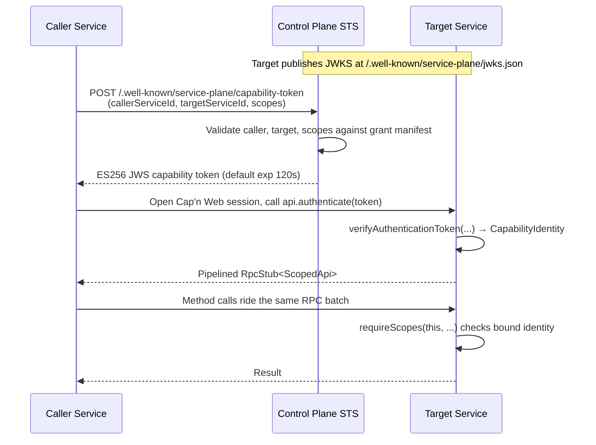

# Architecture

`service-plane` models a system with a public control plane and independently owned RPC services built on [Cap'n Web](https://github.com/cloudflare/capnweb).

The control plane owns global authentication, capability token issuance (STS), JWKS publication, the brokered surface for unauthenticated and end-user traffic, and the manifest of registered services. Each service owns its own `RpcTarget` capabilities, scope catalog, internal storage, workflows, and provider-specific validation.

## Runtime Shape



The control plane is on the token issuance path, not the request data path. Cloudflare-internal services can talk directly through Service Bindings; external HTTPS services use the same handshake. Token verification is local once the service has cached the JWKS — there is no JIT call to the control plane on the hot path.

## Primitives

**Service** — A runtime unit with an id, title, version, and one or more exported capabilities.

**Capability export** — A factory that returns an `RpcTarget` plus a visibility (`public` / `auth` / `internal`) and the scopes its methods statically require. Surfaces in the discovery document and is what the broker brokers.

```ts
defineService({
  capabilities: exampleCapabilities,
  exports: [{
    factory: () => new Public(env),
    id: 'public',
    scopes: ['example.sync.run'],
    visibility: 'public',
  }],
  id: 'example',
  rpcTransports: ['http-batch'],
  title: 'Example',
  version: '0.1.0',
}, { requireRouteScopes: true });
```

**Capability catalog** — `defineCapabilities({...})` declares the operation-level scopes a service exports (e.g. `example.sync.run`). Scopes are owned by the target service, not by callers.

**Authentication handshake** — Convention is a single `authenticate(token)` method on the public root that calls `verifyAuthenticationToken(...)` and `bindCapabilityIdentity(...)` to return the scoped capability target.

**`requireScopes(target, ...)`** — Method-body guard. Reads the verified `CapabilityIdentity` bound to `this` and throws `CapabilityAuthError(403)` if any required scope is missing. The functional form keeps DX uniform across vanilla classes and decorated classes.

**`requireRouteScopes`** — Build-time check on `defineService(..., { requireRouteScopes: true })` that every non-internal exported capability declares scopes. Catches accidentally-public, unauthenticated capabilities at startup.

**Discovery document** — `/.well-known/service-plane/services.json`. JSON describing each service's exported capabilities (id, scopes, visibility, transports). Used by the registry and by tooling. The Cap'n Web RPC contract itself lives in TypeScript types and is not duplicated in JSON.

**Control-plane STS** — `createCapabilityIssuer(...)` + `capabilityTokenHandler(...)`. Signs short-lived ES256 JWS tokens after validating the caller-target-scope grant. The private key never leaves the control plane; services verify against the published JWKS.

**Control-plane registry** — `createServiceRegistry(...)`. Fetches discovery documents from configured endpoints and caches them. Used to enumerate the surface a control-plane broker exposes.

**Control-plane broker** — `createControlPlaneRpcBroker(...)`. An RPC root capability with `public(serviceId)`, `auth(serviceId)`, and `internal(serviceId)` methods that return brokered sub-capabilities. Each brokered capability has a `connect(scopes)` method that mints a token via the issuer and returns the authenticated stub for the target service. The broker enforces visibility based on the supplied `BrokerCaller`.

## Transports

`service-plane` supports the standard Cap'n Web transports:

- **HTTP-batch** (`newHttpBatchRpcSession` / `newHttpBatchRpcResponse`) — default for service-to-service. One round trip per batch, works through Cloudflare Service Bindings, no WebSocket cost.
- **WebSocket** (`newWebSocketRpcSession` / `newWorkersWebSocketRpcResponse`) — opt-in for browsers and long-lived flows.
- **Custom `RpcTransport`** — pass any object that implements `send` / `receive` / `abort`. Used by the in-memory test transport `memoryRpcTransportPair()`.

A service declares which transports it supports via `defineService({ rpcTransports: [...] })`. The default is `['http-batch']`.

## Where service-plane stops

`service-plane` does not own connection storage, workflow engines, tenant databases, OpenAPI generation, or provider SDKs. Those stay service-local. The library is intentionally small: it is the glue between Cap'n Web and a code-first STS.
