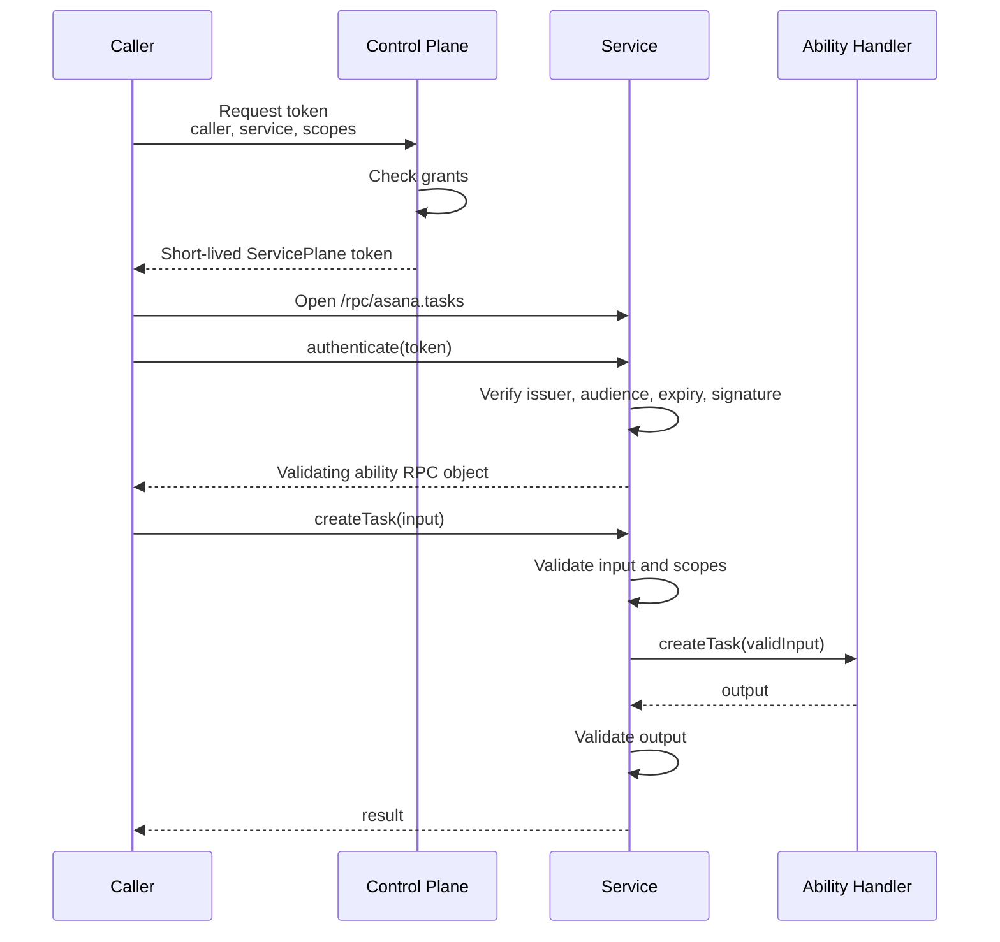
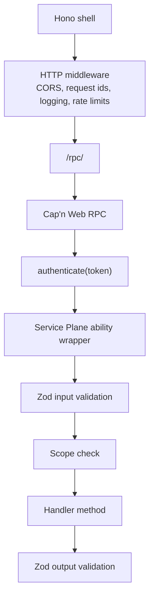
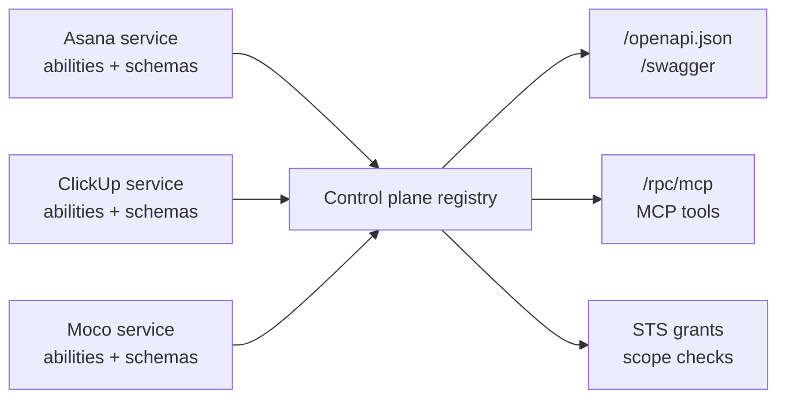

# Architecture

Goal: understand what Service Plane adds, where Cap'n Web fits, and which layer owns auth and validation.

The smallest useful setup has three pieces:

- A service defines abilities.
- A control plane issues short-lived tokens and aggregates discovery metadata.
- A caller opens an ability session and invokes methods.

## Why Service Plane Exists

Normal service APIs often split into REST routes, internal RPC, OpenAPI files, custom auth checks, and separate tool metadata. Service Plane keeps those concerns tied to one source of truth: the ability.

An ability is a schema-backed RPC surface owned by a service. Each method declares:

- one Zod input schema
- one Zod output schema
- required scopes
- optional REST metadata
- optional MCP metadata

The schemas power runtime validation, service discovery, OpenAPI generation, and MCP tool metadata.

## Request Flow

```mermaid
sequenceDiagram
  participant Caller as Caller
  participant Plane as Control Plane
  participant Service as Service
  participant Handler as Ability Handler

  Caller->>Plane: Request token<br/>caller, service, scopes
  Plane->>Plane: Check grants
  Plane-->>Caller: Short-lived ServicePlane token
  Caller->>Service: Open /rpc/asana.tasks
  Caller->>Service: authenticate(token)
  Service->>Service: Verify issuer, audience, expiry, signature
  Service-->>Caller: Validating ability RPC object
  Caller->>Service: createTask(input)
  Service->>Service: Validate input and scopes
  Service->>Handler: createTask(validInput)
  Handler-->>Service: output
  Service->>Service: Validate output
  Service-->>Caller: result
```

## What Cap'n Web Does

Cap'n Web is the RPC engine. It lets callers invoke methods on remote objects through HTTP-batch, WebSocket, or Cloudflare RPC-style bindings.

Service Plane uses Cap'n Web for the method call transport, then adds the service model around it:

```mermaid
flowchart TD
  Hono["Hono shell"] --> Middleware["HTTP middleware<br/>CORS, request ids, logging, rate limits"]
  Middleware --> Endpoint["/rpc/<abilityId>"]
  Endpoint --> CapnWeb["Cap'n Web RPC"]
  CapnWeb --> Auth["authenticate(token)"]
  Auth --> Wrapper["Service Plane ability wrapper"]
  Wrapper --> ZodIn["Zod input validation"]
  ZodIn --> Scopes["Scope check"]
  Scopes --> Handler["Handler method"]
  Handler --> ZodOut["Zod output validation"]
```

Hono middleware sees the HTTP or WebSocket request. Cap'n Web sees the logical method call. That is why method auth and validation live in the Service Plane RPC wrapper, not in Hono middleware.

## Discovery And Projections

Services publish metadata at `/.well-known/service-plane/service.json`. The control plane fetches that metadata, validates grants, and builds projections.

```mermaid
flowchart LR
  Asana["Asana service<br/>abilities + schemas"] --> Registry["Control plane registry"]
  ClickUp["ClickUp service<br/>abilities + schemas"] --> Registry
  Moco["Moco service<br/>abilities + schemas"] --> Registry
  Registry --> OpenAPI["/openapi.json<br/>/swagger"]
  Registry --> MCP["/rpc/mcp<br/>MCP tools"]
  Registry --> Grants["STS grants<br/>scope checks"]
```

Only `exposure: 'published'` methods with REST metadata enter OpenAPI. Only published methods with MCP metadata enter MCP. Private abilities remain available for service-to-service calls and grant validation, but they are not user-facing projections.

## Core Terms

- Ability: schema-backed API surface owned by a service.
- Method: one callable operation on an ability.
- Handler: implementation object returned by the ability factory.
- Context: runtime access such as Hono context, env, bindings, and execution context.
- Identity: verified caller, user, tenant, connection, and scope claims.
- Private: service-to-service ability, excluded from OpenAPI and MCP.
- Published: ability eligible for OpenAPI, Swagger, MCP, or user-facing transports.

Next: [create a service](service-creation.md), then [create a control plane](plane-creation.md).
