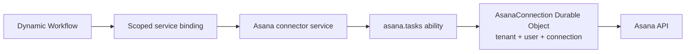

# Cloudflare

Goal: use Service Plane with Workers, Service Bindings, Durable Objects, and Dynamic Workers.

Cloudflare-to-Cloudflare calls should use bindings when possible. Use HTTP-batch for self-hosted services and WebSocket for explicit long-lived sessions.

## Worker-To-Worker Calls

The caller asks the control plane for a token through a private binding, then calls the service through a service binding.

```ts
import {
  abilitySession,
  cloudflareServiceBindingRpc,
  controlPlaneRpcTokenRequester,
  type AbilityRpc,
} from 'service-plane/service';
import { asanaTasks } from './abilities';

const asana = await abilitySession<AbilityRpc<typeof asanaTasks>>({
  abilityId: 'asana.tasks',
  callerServiceId: 'workflow-runner',
  targetServiceId: 'asana',
  scopes: ['asana.tasks.write'],
  requestToken: controlPlaneRpcTokenRequester({
    binding: env.CONTROL_PLANE,
    callerServiceId: 'workflow-runner',
  }),
  transport: cloudflareServiceBindingRpc(env.ASANA),
});
```

`cloudflareServiceBindingRpc(...)` sends HTTP-batch RPC through the binding and defaults to `/rpc/<abilityId>`.

## Native Binding RPC

When the service binding exposes `connectAbility(...)`, use native binding RPC instead of HTTP-batch.

```ts
transport: cloudflareNativeRpc(env.ASANA)
```

Both transports use the same ability wrapper: token verification, Zod validation, method scopes, handler call, and output validation.

## Durable Objects For User Connections

For connector services, use a normal Worker as the service and one Durable Object per user connection.



The service ability stays stateless. The Durable Object owns provider state:

- OAuth access and refresh tokens
- provider-specific config
- cursors and sync checkpoints
- per-connection rate-limit state
- webhook dedupe state

Use identity claims such as `tenantId`, `userId`, and `connectionId` to route to the Durable Object. Do not pass provider credentials through Dynamic Workflow metadata or Service Plane identity.

## Dynamic Workers And Workflows

The loader can inject a small binding into the dynamic workflow.

```ts
await env.ASANA.createTask({
  connectionId: 'conn_123',
  name: 'Follow up',
  projectId: 'proj_456',
});
```

Behind that binding:

1. The loader fixes the tenant, user, connection, and allowed scopes.
2. The binding requests a ServicePlane token.
3. The binding opens an ability session to `asana.tasks`.
4. The Asana service routes the call to the right Durable Object.

This keeps workflow code simple and keeps credentials outside user-authored workflow code.

## When To Use WebSockets

Use WebSocket for long-lived or interactive sessions, such as MCP-style tool sessions or realtime updates.

Do not use WebSocket as the default Worker-to-Worker transport. Bindings are simpler for request/response work and do not need connection lifecycle handling.

Next: [architecture](architecture.md), [auth](auth.md), and [Node.js](nodejs.md).
