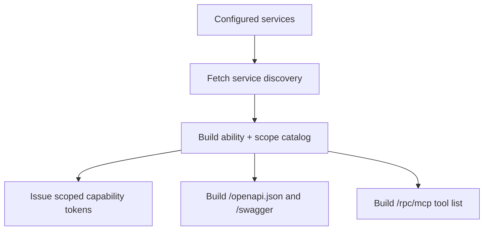

# Create A Control Plane

Goal: create the service that issues tokens, discovers services, and builds user-facing projections.

The smallest useful control plane knows which services exist, which callers may use which scopes, and how to sign capability tokens.

## Minimal Plane

```ts
import {
  ServicePlaneControlPlane,
  cloudflareServiceBinding,
  hmacServiceClientAuth,
} from 'service-plane/control-plane';

export default new ServicePlaneControlPlane({
  signingSecret: (env) => env.STS_SIGNING_SECRET,
  authenticateCaller: (c) =>
    hmacServiceClientAuth({
      clients: [{ clientId: 'workflow-runner', secret: c.env.WORKFLOW_RUNNER_SECRET }],
    })(c),
  services: (c) => [
    cloudflareServiceBinding({
      id: 'asana',
      binding: c.env.ASANA,
      grants: [{ caller: 'workflow-runner', scopes: ['asana.tasks.write'] }],
    }),
  ],
});
```

This mounts:

```txt
POST /.well-known/service-plane/capability-token
GET  /.well-known/service-plane/jwks.json
GET  /openapi.json
GET  /swagger
ALL  /rpc/mcp
```

## What The Plane Does



The plane does not implement Asana, ClickUp, or Moco logic. It only knows how to discover those services, validate grants, issue tokens, and project published metadata.

## Grants

Grants decide which caller can request which scopes for a service.

```ts
cloudflareServiceBinding({
  id: 'asana',
  binding: c.env.ASANA,
  grants: [
    { caller: 'workflow-runner', scopes: ['asana.tasks.write'] },
    { caller: 'admin-worker', scopes: ['asana.tasks.write'] },
  ],
});
```

If a caller asks for an unknown service, unknown scope, or ungranted scope, the token endpoint rejects the request.

## Discovery Cache

The registry can cache service discovery documents. Cache discovery separately from generated OpenAPI.

```ts
const plane = new ServicePlaneControlPlane({
  registry: {
    cache: env.SERVICE_DISCOVERY_CACHE,
    ttlSeconds: 60,
  },
  // ...
});
```

Use discovery caching to avoid repeatedly fetching `/.well-known/service-plane/service.json` from every service.

## OpenAPI Cache

The control plane can cache the bundled OpenAPI document.

```ts
const plane = new ServicePlaneControlPlane({
  openapi: {
    cache: env.OPENAPI_CACHE,
    ttlSeconds: 300,
  },
  // ...
});
```

The bundle is derived from published ability metadata. Individual services do not serve Swagger files.

## Optional Broker

The broker is useful when one caller wants to discover and connect to abilities through the plane.

```ts
new ServicePlaneControlPlane({
  broker: { path: '/rpc/broker' },
  // ...
});
```

The broker connects by ability:

```ts
broker.ability('asana', 'asana.tasks').connect(['asana.tasks.write']);
```

Most service-to-service calls can skip the broker and call the service directly with `abilitySession(...)`.

Next: [auth](auth.md), [OpenAPI and MCP](openapi-mcp.md), and [Cloudflare](cloudflare.md).
