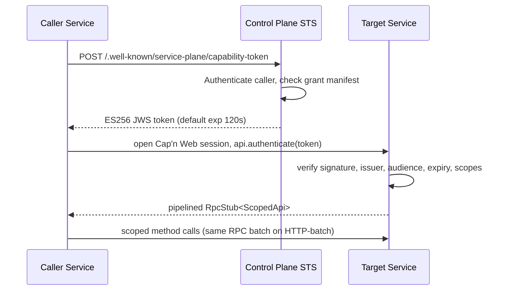

# Service-To-Service Authorization

`service-plane` uses STS capability tokens to authorize service-to-service Cap'n Web sessions.

The control plane is the authorization authority. Services open Cap'n Web sessions directly to each other after receiving a short-lived token; the control plane is not on the hot RPC path.

## Token Flow



The bootstrap `authenticate(token)` and the caller's first method call ride the same network round trip on HTTP-batch transport thanks to Cap'n Web's promise pipelining.

## Token Reuse And Caching

A capability token is reusable until it expires. The default TTL is 120 seconds. Caching is not required for correctness; the target service verifies each token locally with the cached JWKS regardless of where the token came from.

For performance, callers should keep a token cache per unique `(callerServiceId, targetServiceId, scopes)` tuple. `createCapabilityTokenProvider({...})` does this in-memory, and `capabilityRpcSession({...})` accepts a `CapabilityTokenCache` that can shard across isolates. See [caching.md](caching.md).

## Authentication Handshake

The convention is a single `authenticate(token)` method on the public root capability:

```ts
class Public extends RpcTarget {
  constructor(private readonly env: Env) { super(); }
  async authenticate(token: string) {
    const identity = await verifyAuthenticationToken(token, {
      expectedAudience: 'example',
      issuer: 'control-plane',
      jwks: jwksFromServiceBinding(this.env.CONTROL_PLANE),
    });
    return bindCapabilityIdentity(new Scoped(), identity);
  }
}
```

`bindCapabilityIdentity(target, identity)` associates the verified identity with the scoped target. Once bound, every method on the target may call `requireScopes(this, ...)` to enforce scope requirements. The bound identity is also reachable via `capabilityIdentity(this)`.

## Scope Enforcement

Use `requireScopes(this, 'scope.id', ...)` at the top of any method that needs a scope check:

```ts
class Scoped extends RpcTarget {
  async runSync() {
    const me = requireScopes(this, 'example.sync.run');
    return { caller: me.serviceId };
  }
}
```

For codebases that prefer decorators, the `scope(...)` decorator wraps the method body with the same check. Plain function-call form remains the default — it is explicit and works without decorator-syntax build flags.

## Direct vs. Brokered Calls

Two patterns are supported:

1. **Direct.** The caller obtains an STS token from the control plane and opens its own Cap'n Web session against the target service. Lowest latency, least coupling. Use `capabilityRpcSession({...})`.
2. **Brokered.** The caller opens a Cap'n Web session against the control plane and asks for a brokered stub via `broker.public(serviceId)`, `broker.auth(serviceId)`, or `broker.internal(serviceId)`. The control plane mints the token and proxies. Useful for unauthenticated public traffic that should not learn service URLs, and for end-user-authenticated `auth` traffic.

Direct calls are the default for service-to-service. Use the broker for the `public` surface and for `auth` traffic that needs end-user attribution.
