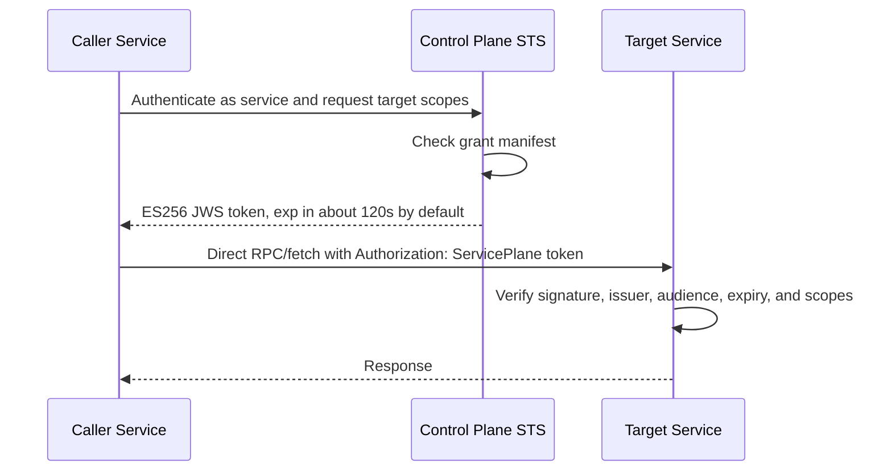

# Service-To-Service Authorization

`service-plane` uses STS capability tokens for direct service-to-service calls.

The control plane is the authorization authority. Services call each other directly after receiving a short-lived token, so the control plane is not on the hot request path.

## Token Flow



## Token Reuse And Caching

A capability token is reusable until it expires. The default max TTL is 120 seconds. Caching is not required for correctness or security: if a caller has no cached token, it can request a new one from the control plane before calling the target service.

The target service never needs a token cache. It verifies each request locally with the control plane public JWKS, checking signature, issuer, audience, expiry, and scopes. Use `jwksFromServiceBinding(...)` on Cloudflare or `jwksFromUrl(...)` for HTTPS services so the service fetches and caches the public JWKS instead of storing key material in config.

For performance, a caller should keep a best-effort token cache per unique permission set:

```txt
callerServiceId + targetServiceId + sorted scopes
```

`createCapabilityTokenProvider(...)` implements an in-memory cache by default. It requests a token once, reuses it for matching calls, and refreshes shortly before expiry.

Cloudflare Workers can run different requests in different isolates, so module memory is an optimization, not a durability guarantee. If that causes too many STS requests, pass a shared cache adapter:

```ts
import { controlPlaneHmacTokenRequester } from 'service-plane/service';

const tokenProvider = createCapabilityTokenProvider({
  cache: capabilityTokenCache,
  callerServiceId: 'moco',
  targetServiceId: 'fizzy',
  scopes: ['fizzy.users.lookup'],
  requestToken: controlPlaneHmacTokenRequester({
    clientId: 'moco',
    clientSecret: process.env.MOCO_HMAC_SECRET,
    controlPlaneUrl: 'https://control-plane.internal',
  }),
});
```

The cache stores already-issued short-lived tokens. It does not store the STS private key or grant policy, and it does not require an additional service per worker. Good Cloudflare options are Cache API for edge-local reuse or Workers KV when cross-isolate reuse is more important than strict read-after-write behavior.

```ts
const tokenProvider = createCapabilityTokenProvider({
  callerServiceId: 'moco',
  targetServiceId: 'fizzy',
  scopes: ['fizzy.users.lookup'],
  requestToken: controlPlaneHmacTokenRequester({
    clientId: 'moco',
    clientSecret: process.env.MOCO_HMAC_SECRET,
    controlPlaneUrl: 'https://control-plane.internal',
  }),
});

const client = hc<FizzyRoutes>('https://fizzy.internal', {
  fetch: capabilityFetch({ tokenProvider }),
});
```

For maximum performance:

- Create token providers once per service client, not inside every handler.
- Reuse the same provider for repeated calls with the same target and scopes.
- Keep scopes narrow, but group scopes that are always used together to avoid unnecessary token fetches.
- Use the default short TTL unless the target operation is very latency-sensitive and revocation speed is less important. Caller-requested TTLs are clamped to the issuer max TTL.

The target service still validates every request locally. Token caching only avoids repeated STS calls; it does not skip verification on the target.

## Service-To-Plane Authentication

Services must authenticate when they ask the control plane for a token. Do not use a caller-supplied service id header as identity.

For distributed HTTP deployments, generate one HMAC secret per caller:

```sh
node --input-type=module -e "import { generateServiceClientSecret } from 'service-plane/control-plane'; console.log('MOCO_HMAC_SECRET=' + generateServiceClientSecret())"
```

Store the secret in the caller and the control plane. Configure the control plane with `hmacServiceClientAuth(...)`, which verifies a signature bound to method, path, body, timestamp, client id, and request id. The grants still decide which target scopes that service may receive.

## Why Not Remove Token Acquisition?

There are cryptographic alternatives that avoid runtime token acquisition, but they move authorization complexity into every service:

- Per-service signed requests: each caller signs every request with its own private key, and each target verifies caller public keys plus grant policy locally.
- Mutual TLS: infrastructure authenticates both sides, but each target still needs its own authorization policy.
- Shared HMAC secrets: simpler mechanically, but weaker for this model because a shared secret can let services bypass central grants.

STS keeps the grant decision centralized while keeping target verification local. The only online control-plane dependency is token issuance. In normal operation, the caller-side token cache amortizes that cost across many service calls.

## Scope Ownership

Scopes are owned by the target service. A route declares its required operation scopes:

```ts
import { createFactory } from 'hono/factory';
import { capability } from 'service-plane/service';

const factory = createFactory();
const routes = factory.createApp().get(
  '/providers/fizzy/v1/users/:email',
  capability('fizzy.users.lookup'),
  (c) => c.json({ ok: true }),
);
```

The control plane owns grants. In the high-level wrapper, keep them on the target service registration:

```ts
httpsService({
  baseUrl: 'https://fizzy.internal',
  id: 'fizzy',
  grants: [{ caller: 'moco', scopes: ['fizzy.users.lookup'] }],
})
```

This splits responsibility cleanly:

- Target service: defines what operations exist.
- Control plane: decides which callers may receive tokens.
- Caller service: asks for the minimum scopes it needs.

Capability catalogs can be shared through a contracts package or discovered at runtime from service discovery. See [Capability Catalogs](capability-catalogs.md).

`capabilityAuth(...)` only configures token verification for downstream route middleware. It does not authorize a route by itself. Put `capability(...)` on routes that require service-to-service authorization, or call `verifyCapabilityToken(...)` manually with `requiredScopes` for non-Hono/RPC entrypoints.

For stricter service packages, use `defineService(service, { requireRouteScopes: true })`. This fails fast when a route is registered without `capability(...)`, and `defineService(...)` always validates that route scopes exist in the service capability catalog.

## User Authorization Boundary

The pattern “user authorization is done in the control plane; services do not care about users” is useful, but only if stated precisely.

It is reasonable for product-level user authorization:

- The control plane authenticates users and decides whether a user may configure or trigger a workflow.
- The control plane translates that user action into service-to-service calls.
- Services receive service identity and capability scopes, not raw user sessions.

It is not enough when a service owns user-visible data boundaries:

- If a service stores tenant data, connection ownership, or user-specific records, it should still enforce those resource boundaries.
- Prefer passing stable resource identifiers such as `connectionId`, `ownerId`, or `tenantId` in the request body and validating them against service-local state.
- Do not let a broad service token mean “access all data.”

The reusable rule is:

```txt
Control plane authorizes who may ask.
Target service authorizes what the token may do to its own resources.
```

## Avoiding STS Bypass

Do not use one shared mesh secret for all services.

If every service knows the same secret and target services accept that secret as internal request authorization, any service can impersonate another service or skip STS grants.

Use separate trust channels:

- STS signing key: private key lives only in the control plane.
- STS verification key: public JWKS is published by the control plane and fetched by services.
- Service-to-plane authentication: each service may have its own credential for requesting tokens.
- Service-to-service authorization: targets accept STS capability tokens, not peer shared-secret signatures.

For service-to-service APIs, use `capabilityAuth(...)` and `capability(...)`.
